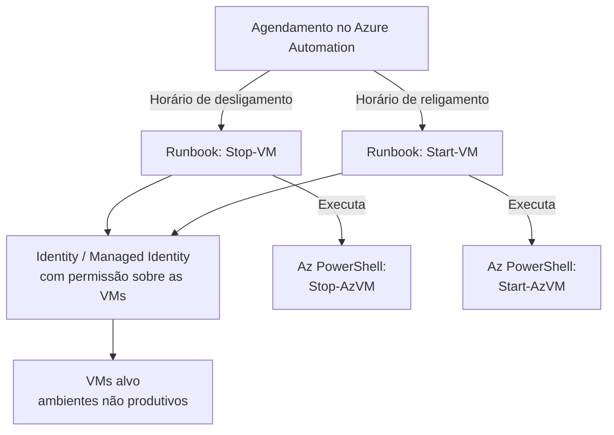

# Automação de Start/Stop de VMs no Azure via Runbook (Otimização de Custo)

> Implementação de rotina automatizada para ligar e desligar máquinas virtuais no Azure fora do horário de uso, utilizando Azure Automation Runbook com script PowerShell, reduzindo custo de VMs que não precisam rodar 24/7.

## Problema que resolve

VMs de ambientes não produtivos (desenvolvimento, homologação, testes e jumpserver) frequentemente permanecem ligadas fora do horário comercial, gerando custo de computação sem uso real. Desligar e ligar manualmente essas VMs todos os dias não é escalável nem confiável, pois depende de intervenção humana, ou seja, alguém lembrar de fazer isso consistentemente.

O objetivo foi automatizar esse ciclo através de um Runbook do Azure Automation, garantindo que as VMs fossem desligadas fora do horário de uso e religadas automaticamente no horário definido, sem depender de ação manual.

## Arquitetura da automação

## Como foi implementado

**Script PowerShell no Runbook**
Um script em PowerShell, usando os cmdlets do módulo Az (`Start-AzVM` / `Stop-AzVM`), foi publicado como Runbook dentro de uma Automation Account do Azure. O script identifica as VMs alvo (por Resource Group, tag ou lista explícita) e aplica a ação de start ou stop correspondente.

**Agendamento via Schedule do Azure Automation**
Dois agendamentos foram configurados, sendo um para o horário de desligamento definido para cada cliente e outro para o horário de religamento (geralmente no início do expediente). Cada um disparando o Runbook correspondente automaticamente, sem intervenção manual.

**Identidade com permissão mínima necessária**
O Runbook foi configurado para autenticar usando uma identidade gerenciada (Managed Identity ou Service Principal) com permissão limitada apenas à ação de start/stop sobre as VMs alvo, seguindo o princípio de menor privilégio em vez de usar uma conta com permissões administrativas amplas.

## Desafios enfrentados

- **Seleção correta das VMs alvo**: garantir que o script atingisse apenas as VMs pretendidas e elegíveis a este modelo, evitando desligar por engano uma VM de produção que compartilhasse o mesmo Resource Group.
- **Tratamento de exceções**: VMs que já estavam desligadas manualmente antes do horário programado, ou que estavam em processo de manutenção, precisavam ser tratadas pelo script sem gerar erro que interrompesse a execução das demais.
- **Validação de economia real**: acompanhar se a automação estava de fato reduzindo o consumo esperado, cruzando o horário de execução dos Runbooks com o relatório de consumo das assinaturas.

## Resultados

- Redução de custo em VMs de ambientes não produtivos, eliminando o tempo ocioso fora do horário de uso sem depender de ação manual.
- Processo consistente e auditável com o histórico de execução dos Runbooks no Azure Automation permite confirmar que o desligamento/religamento ocorreu como esperado.
- Modelo replicável para outros grupos de VMs com necessidade semelhante de agendamento.

## Aprendizados

- Automação de start/stop é uma das formas mais simples e efetivas de redução de custo em nuvem, mas o valor real depende de escopo correto como: identificar exatamente quais VMs realmente não precisam rodar 24/7.
- Usar identidade com permissão mínima no Runbook, em vez de credenciais administrativas amplas, reduz o risco de um script de automação causar impacto além do escopo pretendido.

---
**Autor:** Danilo Lima — Cloud Architect | Senior Cloud Specialist
[LinkedIn](https://linkedin.com/in/danilo-lima-9ba0375a/)

> Nota: este case study descreve uma automação real de FinOps/otimização de custo aplicada profissionalmente, com dados de ambiente removidos por confidencialidade.
