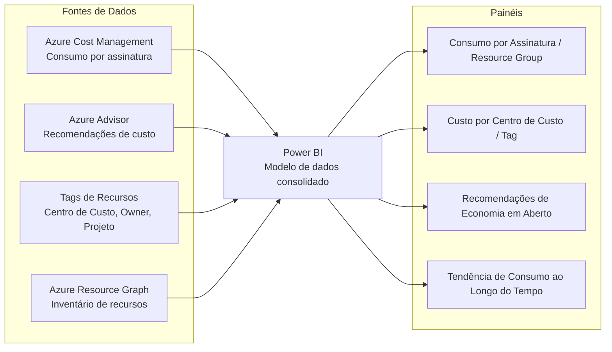

# Dashboard de FinOps com Power BI para Visibilidade de Custos Multi-Assinatura

> Construção de um painel de Power BI consolidando dados de consumo, recomendações do Azure Advisor e alocação de custos por Tag, dando visibilidade financeira do ambiente Azure para times técnicos e não técnicos.

## Problema que resolve

Ambientes Azure com múltiplas assinaturas e Resource Groups tornam difícil responder perguntas financeiras básicas, tais como: "para onde foi o consumo do mês?", "qual área é responsável por qual custo?", "quais recomendações de economia estão disponíveis e ainda não foram aplicadas?". O portal nativo do Azure (Cost Management) oferece visão por assinatura, mas não consolida facilmente múltiplas assinaturas em um único painel executivo, nem cruza automaticamente com dados de recomendação do Azure Advisor.

O objetivo foi construir um dashboard central que desse essa visibilidade, tanto para o time técnico quanto para gestores que precisam entender consumo sem entrar no portal do Azure.

## Abordagem

## Decisões de construção

**Consolidação multi-assinatura em um único modelo**
Em vez de depender da visão nativa do Azure (limitada por assinatura), os dados de consumo foram extraídos e consolidados num modelo único do Power BI, permitindo comparar e somar custos entre assinaturas diferentes num só painel.

**Cruzamento com recomendações do Azure Advisor**
As recomendações de custo do Azure Advisor (ex: recursos subutilizados, candidatos a Rightsizing ou desligamento) foram incorporadas ao mesmo modelo de dados, permitindo visualizar não só quanto está sendo gasto, mas quanto **poderia estar sendo economizado** com ações já identificadas e ainda não aplicadas.

**Alocação por Tag como eixo central de análise**
As tags de recurso (Centro de Custo, Proprietário, Projeto, Ambiente) definidas na camada de governança foram usadas como principal dimensão de corte no Power BI, permitindo que cada área de negócio visualizasse apenas o custo relativo a ela (Chargeback/Showback), sem depender de acesso direto ao portal Azure.

**Painel pensado para audiência não técnica**
Diferente do portal do Azure (voltado para quem administra o ambiente), o dashboard foi desenhado com visões executivas e com tendência de consumo, comparação mês a mês e top recursos por custo, pensado para gestores que precisam decidir sobre orçamento sem interpretar terminologia técnica de nuvem.

## Desafios enfrentados

- **Dados inconsistentes por falta de Tag**: recursos criados antes da padronização de tags apareciam sem classificação, exigindo tratamento no modelo de dados para não distorcer os relatórios por centro de custo.
- **Atualização periódica dos dados**: manter o painel refletindo o consumo real exigiu definir uma rotina de atualização (refresh) alinhada ao ciclo de fechamento de custos do Azure, evitando decisões tomadas sobre dados desatualizados.
- **Tradução de métricas técnicas para linguagem de negócio**: parte do trabalho foi decidir quais métricas do Azure Advisor e Cost Management realmente importavam para quem tomava decisão orçamentária, evitando um painel sobrecarregado de dados técnicos irrelevantes para esse público.

## Resultados

- Visibilidade consolidada de custos multi-assinatura em um único painel, sem depender de acesso direto ao portal Azure.
- Recomendações de economia do Azure Advisor tornadas visíveis e rastreáveis, facilitando cobrança sobre quais ainda não haviam sido aplicadas.
- Alocação de custo por Tag (Chargeback/Showback) tornando cada área responsável visível pelo seu próprio consumo.

## Aprendizados

- Um dashboard de FinOps só gera valor se a taxonomia de Tags estiver bem definida antes — o painel é reflexo direto da qualidade da governança de dados subjacente.
- Consolidar dados técnicos (Advisor, Cost Management) numa camada de visualização acessível é o que transforma FinOps de uma disciplina técnica em uma prática de negócio, compreendida por quem decide orçamento.

---
**Autor:** Danilo Lima — Cloud Architect | Senior Cloud Specialist
[LinkedIn](https://linkedin.com/in/danilo-lima-9ba0375a/)

> Nota: este case study descreve uma prática de FinOps real aplicada profissionalmente, com nomes de cliente e dados específicos removidos por confidencialidade.
