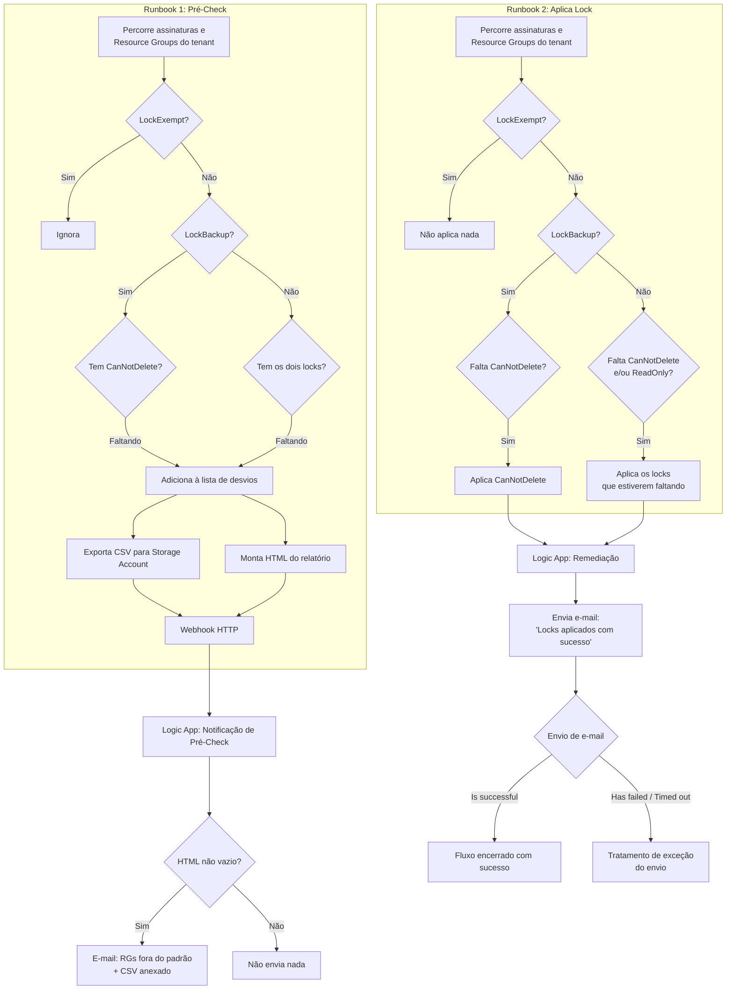

# Automação de Governança: Detecção, Correção e Notificação de Resource Locks

> Conjunto de dois runbooks em PowerShell (Azure Automation), responsáveis por detectar e corrigir desvios, e dois Logic Apps, responsáveis por **entregar essa informação por e-mail** aos responsáveis em cada etapa construído com apoio do Copilot.

## Problema que resolve

Definir uma política de Resource Locks (bloqueio contra exclusão acidental) é fácil, mas garantir que ela continue sendo seguida à medida que novos Resource Groups são criados no dia a dia é o desafio real. Sem uma auditoria automatizada, a única forma de saber se um Resource Group ficou sem o lock esperado é descobrir isso tarde demais, geralmente depois de um incidente.

A solução foi dividida em responsabilidades separadas: os runbooks ficam responsáveis por **detectar e corrigir**, enquanto os Logic Apps ficam responsáveis por **entregar essa informação por e-mail** às partes interessadas e um confirmando os desvios encontrados no pré-check, outro confirmando quando a correção foi aplicada com sucesso.

## Regras de governança aplicadas

| Cenário | Tag | Regra esperada |
|---|---|---|
| Isento de política | `LockExempt = true` | Nunca entra no relatório nem recebe lock |
| Ambiente de backup | `LockBackup = true` | Precisa do lock `CanNotDelete` e **não pode** ter `ReadOnly` (bloqueia o Azure Backup) |
| Padrão geral | Sem essas tags | Precisa dos locks `CanNotDelete` **e** `ReadOnly` |

## Arquitetura da automação

## Os componentes, em detalhe

**Runbook de Pré-Check (detecção)**
Percorre todas as assinaturas monitoradas, ignora Resource Groups de serviço (ex: os automaticamente criados pelo Azure Backup) e classifica cada Resource Group segundo a tabela de regras acima. Quando encontra desvios, gera um CSV (salvo em um Storage Account, para histórico) e monta um relatório em HTML, enviando ambos via webhook para um Logic App de notificação, que só dispara e-mail se o relatório não estiver vazio. Também existe uma variante mais simples desse runbook, pensada para alimentar alertas do Azure Monitor com uma saída direta de "OK" ou "ALERTA", sem depender do fluxo de e-mail.

**Runbook de Aplicação de Lock (correção automática)**
Segue a mesma lógica de classificação por tag, mas em vez de apenas reportar, **aplica o lock que estiver faltando**: `CanNotDelete` para Resource Groups de backup, e `CanNotDelete`/`ReadOnly` (o que estiver ausente) para os demais. Resource Groups isentos (`LockExempt`) nunca recebem lock automaticamente.

**Logic App de Remediação (confirmação de sucesso)**
Um segundo Logic App, dedicado, recebe o resultado do runbook de correção e envia uma notificação por e-mail confirmando quais Resource Groups tiveram o lock aplicado com sucesso. Depois do envio, um bloco de **Condition** trata o resultado dessa própria notificação (sucesso, timeout, pulado ou falha), permitindo adicionar tratamento de exceção caso o e-mail de confirmação não seja entregue. Importante para não assumir silenciosamente que a equipe foi avisada quando, na verdade, a notificação falhou.

**Autenticação via Managed Identity**
Ambos os runbooks autenticam usando `Connect-AzAccount -Identity`, sem depender de credenciais armazenadas no próprio script.

**Desenvolvimento com apoio do Copilot**
A construção e o refinamento da lógica condicional, tanto nos runbooks quanto no fluxo dos Logic Apps, foram feitos com apoio do Copilot.

## Desafios enfrentados (e corrigidos)

- **Falso positivo em Resource Groups de backup**: numa versão inicial, Resource Groups com `LockBackup=true` chegaram a ser reportados como fora do padrão mesmo já tendo o lock de Delete, porque a verificação ainda exigia também o `ReadOnly`, que na verdade **quebra as operações do Azure Backup**. A regra foi revisada para que `LockBackup=true` exija somente o `CanNotDelete`.
- **Separar detecção, correção e confirmação em componentes distintos**: em vez de um único fluxo monolítico, cada responsabilidade ficou isolada (dois runbooks + dois Logic Apps), permitindo auditar e ajustar cada etapa de forma independente.
- **Tratar falha na própria notificação**: adicionar uma verificação de sucesso/falha após o envio do e-mail de remediação evita o cenário de a correção ter funcionado, mas a equipe nunca ficar sabendo por uma falha silenciosa no envio.
- **Evitar ruído de notificação no pré-check**: sem a condição de "só notificar se houver conteúdo", o e-mail de pré-check seria disparado a cada execução, mesmo sem nenhum desvio.

## Resultados

- Auditoria, correção e confirmação de conformidade de Resource Locks totalmente automatizadas em todo o tenant.
- Resource Groups de backup corrigidos automaticamente sem risco de receber um lock que quebraria as rotinas de backup.
- Cada etapa (detecção, correção, confirmação) rastreável e notificada de forma independente, com tratamento de falha na própria notificação.

## Aprendizados

- Separar detecção, correção e confirmação em componentes distintos deixa cada peça mais simples de testar e auditar, além de permitir tratar falhas em qualquer etapa isoladamente, sem que uma falha silenciosa numa notificação passe despercebida.
- Regras de governança baseadas em Tag só funcionam se a lógica tratar corretamente cada combinação de cenário, um caso de exceção mal tratado (como o `LockBackup`) gera desconfiança na automação inteira.
- Ferramentas de IA como o Copilot são especialmente úteis para iterar rápido sobre lógica condicional e integração entre múltiplos componentes (runbooks e Logic Apps).

---
**Autor:** Danilo Lima — Cloud Architect | Senior Cloud Specialist
[LinkedIn](https://linkedin.com/in/danilo-lima-9ba0375a/)

> Nota: este case study descreve uma automação de governança real desenvolvida profissionalmente, com Subscription ID, nomes de recursos, e-mail e URL de webhook removidos ou substituídos por valores genéricos por confidencialidade.
