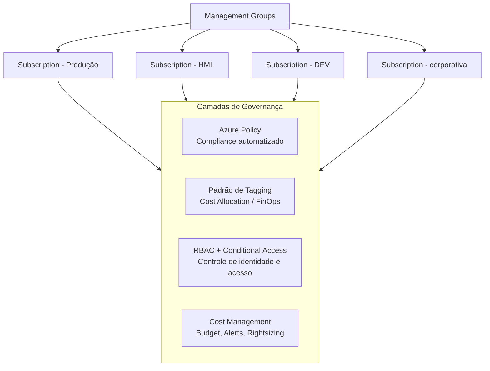

# Modelo de Governança para Ambiente Azure Corporativo (Enterprise Agreement)

> Definição de um modelo formal de governança para operação de um ambiente Microsoft Azure em contrato corporativo (Enterprise Agreement), cobrindo estrutura organizacional de recursos, controle de custos, segurança de identidade e conformidade.

## Problema que resolve

Ambientes Azure operados sob contrato corporativo (Enterprise Agreement) tendem a crescer organicamente com múltiplas assinaturas, múltiplos times provisionando recursos, sem um padrão comum de nomenclatura, tagueamento ou controle de acesso. Sem um modelo de governança formal, isso gera dificuldade de rastrear custos por área de negócio, inconsistência de segurança entre ambientes e falta de visibilidade para auditoria.

O objetivo foi propor um modelo de operação e governança formal, documentado e apresentável a múltiplos interessados (arquitetura, segurança, financeiro), definindo os requisitos necessários para padronizar como o ambiente Azure deveria ser administrado dali em diante.

## Estrutura do modelo de governança

## Pilares definidos no modelo

**Estrutura de Management Groups e Subscriptions**
Organização hierárquica separando ambientes por finalidade (DEV, HML, produção, corporativo), permitindo aplicar políticas e controles de forma consistente por nível, sem depender de configuração manual em cada assinatura.

**Padrão de Tagging para FinOps**
Definição de tags obrigatórias (ex: centro de custo, ambiente, responsável, projeto) aplicadas a todo recurso provisionado, viabilizando alocação de custos (Cost Allocation), Chargeback/Showback e relatórios financeiros por área de negócio.

**RBAC e Conditional Access como camada de identidade**
Modelo de acesso baseado em papéis (RBAC), combinado com Conditional Access e MFA, garantindo que o nível de permissão de cada usuário/grupo fosse proporcional à sua real necessidade operacional (princípio de menor privilégio).

**Azure Policy para conformidade automatizada**
Políticas aplicadas nos Management Groups para impedir a criação de recursos fora do padrão definido (ex: regiões não autorizadas, SKUs não aprovados, ausência de tags obrigatórias), transformando a governança de uma checagem manual reativa em um controle preventivo automatizado.

**Cost Management e otimização contínua**
Definição de budgets, alertas de consumo e rotina de revisão de Rightsizing e Reservas de Instância, incorporando FinOps como prática contínua e não como uma revisão pontual.

**Alertas proativos via Azure Advisor, Service Health e Resource Health**
Toda assinatura provisionada passou a ter alertas configurados nas quatro categorias do Azure Advisor (Custo, Desempenho, Confiabilidade e Excelência Operacional), além de alertas de Service Health (interrupções na plataforma Azure) e Resource Health (degradação de recursos específicos), transformando a operação de reativa (descobrir o problema quando o usuário reclama) para proativa.

**Resource Locks e Microsoft Defender for Cloud como camadas de proteção**
Bloqueios do tipo "Somente Leitura" aplicados a nível de Resource Group de produção (nunca a nível de assinatura inteira, para não impactar serviços como backup e\ou LogicApps) para prevenir exclusão acidental de recursos críticos. Em paralelo, o Microsoft Defender for Cloud foi habilitado nas assinaturas de produção, com notificações por severidade e integração ao Log Analytics para centralizar eventos de segurança.

## Desafios enfrentados

- **Múltiplos interessados com prioridades diferentes**: o modelo precisou equilibrar as necessidades de arquitetura, segurança e financeiro — apresentado formalmente a diferentes áreas antes de ser adotado como padrão.
- **Ambiente já em operação**: diferente de um ambiente greenfield, o modelo precisou considerar como aplicar governança a recursos já existentes, sem interromper operações críticas em produção.
- **Formalização e comunicação**: parte relevante do trabalho foi documentar o modelo de forma clara o suficiente para ser apresentado e validado por áreas não necessariamente técnicas.

## Resultados

- Modelo de governança formalizado e documentado, cobrindo estrutura de recursos, custos, segurança e conformidade.
- Base padronizada para conduzir apresentação e alinhamento com múltiplos interessados antes da adoção.
- Direcionamento claro para operação do ambiente Azure sob um único padrão, reduzindo inconsistência entre times.

## Aprendizados

- Governança de nuvem eficaz não é só uma política técnica, mas depende de comunicação clara com áreas não técnicas para ser adotada de fato.
- Modelos de governança aplicados a ambientes já em operação exigem uma estratégia de adoção gradual, diferente de quando se parte do zero.

---
**Autor:** Danilo Lima — Cloud Architect | Senior Cloud Specialist
[LinkedIn](https://linkedin.com/in/danilo-lima-9ba0375a/)

> Nota: este case study descreve um modelo de governança real proposto e realizado profissionalmente, com nome de empresa, contrato e dados de terceiros removidos por confidencialidade.
