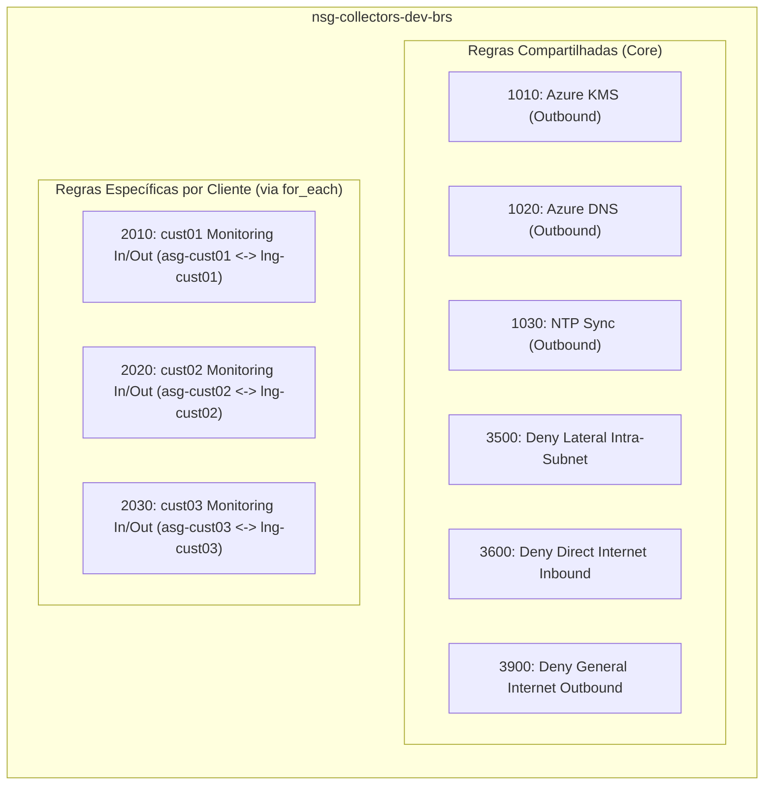

# Baseline de Segurança de Rede e Conectividade — Azure Monitoring Hub (`monhub`)

- **Status**: Aprovado (Baseline Arquitetural V1)
- **Data**: 2026-10-02
- **Autor / Papel**: Cloud Architect — Azure Monitoring Hub
- **Documentos de Referência**:
  - [PROJECT.md](file:///C:/Users/drlim/ENTERPRISE-CLOUD-CASE-STUDIES/azure-monitoring-hub/PROJECT.md)
  - [SECURITY.md](file:///C:/Users/drlim/ENTERPRISE-CLOUD-CASE-STUDIES/azure-monitoring-hub/SECURITY.md)
  - [ARCHITECTURE.md](file:///C:/Users/drlim/ENTERPRISE-CLOUD-CASE-STUDIES/azure-monitoring-hub/docs/architecture/ARCHITECTURE.md)
  - [ADR-001-vng-sku.md](file:///C:/Users/drlim/ENTERPRISE-CLOUD-CASE-STUDIES/azure-monitoring-hub/docs/architecture/adr/ADR-001-vng-sku.md)
  - [ADR-002-collector-vm.md](file:///C:/Users/drlim/ENTERPRISE-CLOUD-CASE-STUDIES/azure-monitoring-hub/docs/architecture/adr/ADR-002-collector-vm.md)

---

## 1. Visão Geral e Princípios Fundamentais

Este documento estabelece a baseline formal de segurança de rede, segmentação de tráfego e conectividade híbrida para a V1 do projeto **Azure Monitoring Hub** (`monhub`), com base na arquitetura aprovada para o Resource Group `rg-monhub-dev-brs` na região `Brazil South`.

A topologia adota o modelo de conectividade centralizada (*Hub-and-Spoke* híbrida), hospedando coletores Windows Server dedicados por cliente sobre uma infraestrutura de rede compartilhada e terminando túneis VPN Site-to-Site (IKEv2) em um gateway compartilhado.

```mermaid
flowchart TD
    subgraph VNet["vnet-monhub-dev-brs (10.240.0.0/20)"]
        subgraph GWSnet["GatewaySubnet (10.240.0.0/26) - Sem NSG"]
            VNG["vng-monhub-dev-brs\n(VpnGw1AZ / Gen1 / IKEv2)\nPublic IP: pip-vng-monhub-dev-brs"]
        end

        subgraph ColSnet["snet-collectors-dev-brs (10.240.1.0/24)"]
            NSG["NSG: nsg-collectors-dev-brs\n(Políticas de Isolamento e Menor Exposição)"]

            subgraph Cust01_Scope["Escopo Dedicado: Cliente 01"]
                ASG1["asg-cust01-dev-brs"]
                VM1["vm-col-cust01-dev-brs\n(10.240.1.10 - Sem Public IP)"]
                VM1 --- ASG1
            end

            subgraph Cust02_Scope["Escopo Dedicado: Cliente 02"]
                ASG2["asg-cust02-dev-brs"]
                VM2["vm-col-cust02-dev-brs\n(10.240.1.11 - Sem Public IP)"]
                VM2 --- ASG2
            end

            NSG -. Protege e Isola .- ColSnet
            ASG1 x-.-x|"BLOQUEIO LATERAL (Deny Intra-Subnet)"| ASG2
        end
    end

    subgraph Rem01["Rede Remota Cliente 01 (ex.: 192.168.10.0/24)"]
        LNG1["lng-cust01-dev-brs"]
    end

    subgraph Rem02["Rede Remota Cliente 02 (ex.: 192.168.20.0/24)"]
        LNG2["lng-cust02-dev-brs"]
    end

    VNG <== "VPN S2S IKEv2 (con-cust01-dev-brs)" ==> LNG1
    VNG <== "VPN S2S IKEv2 (con-cust02-dev-brs)" ==> LNG2

    ASG1 == "Tráfego de Telemetria Autorizado" ==> LNG1
    ASG2 == "Tráfego de Telemetria Autorizado" ==> LNG2

    ASG1 x-.-x|"BLOQUEIO DE ACESSO CRUZADO"| LNG2
    ASG2 x-.-x|"BLOQUEIO DE ACESSO CRUZADO"| LNG1
```

### 1.1 Princípios Arquiteturais Obrigatórios
1. **Zero Trust & Menor Exposição de Rede**: Nenhuma comunicação é permitida por padrão. Todo fluxo deve possuir justificativa técnica explícita, origem/destino restritos e portas mínimas necessárias.
2. **Ausência Absoluta de IP Público nos Collectors**: As máquinas virtuais de monitoramento operam exclusivamente com IPs privados estáticos (`public_ip_address_id = null`). A única interface pública de toda a topologia pertence ao Virtual Network Gateway (`pip-vng-monhub-dev-brs`, Standard SKU, zone-redundant).
3. **Isolamento Multi-Customer Estrito**: A existência de múltiplos clientes na mesma VNet compartilhada não permite tráfego direto ou visibilidade de rede entre coletores de clientes distintos.
4. **Defesa em Profundidade (*Defense in Depth*)**: A proteção é implementada em múltiplas camadas coordenadas:
   - *Camada de Subnetting*: Separação entre trânsito (`GatewaySubnet`) e cargas de trabalho (`snet-collectors-dev-brs`);
   - *Camada de Filtragem de Pacotes*: NSG associado à subnet de coletores;
   - *Camada de Identidade de Rede*: ASGs dedicados vinculados às NICs dos coletores;
   - *Camada de Túnel e Roteamento*: Criptografia IKEv2/IPsec e validação matemática de sobreposição de CIDRs (Overlap Detection).

---

## 2. Estratégia de NSG da Subnet de Collectors (`nsg-collectors-dev-brs`)

### 2.1 Alocação e Escopo do NSG
- O recurso `nsg-collectors-dev-brs` é associado **exclusivamente à subnet `snet-collectors-dev-brs`** (`10.240.1.0/24`).
- **Proibição em `GatewaySubnet`**: Em estrita conformidade com as diretrizes e suporte do Microsoft Azure, a `GatewaySubnet` **não possui e não deve receber associação de NSG**. A inclusão de NSG na subnet do gateway interrompe planos de controle e gerenciamento interno do VNG (`vng-monhub-dev-brs`).

### 2.2 Estrutura de Prioridades e Nomenclatura das Regras
As regras de segurança do NSG seguem uma estrutura padronizada de prioridades para evitar sobreposições e facilitar a automação via Terraform:

| Faixa de Prioridade | Categoria de Regras | Finalidade e Comportamento |
| :--- | :--- | :--- |
| **1000 – 1999** | **Infraestrutura Azure Essencial** | Regras estáticas compartilhadas para sustentação do SO (KMS, DNS, NTP). |
| **2000 – 2999** | **Regras Específicas por Cliente (ASG)** | Regras dinâmicas parametrizadas que autorizam fluxos entre cada coletor e sua respectiva rede remota. |
| **3000 – 3499** | **Regras Administrativas Restritas** | Regras para acesso administrativo ao host (se aplicável), sob canais privados. |
| **3500 – 3999** | **Regras Explícitas de Bloqueio (Deny Override)** | Regras que sobrepõem as regras padrão do Azure para garantir isolamento lateral e corte de Internet. |
| **4000 – 65000** | *Espaço de Expansão* | Reservado para novas camadas ou serviços compartilhados da plataforma. |
| **65000+** | **Regras Padrão da Plataforma Azure** | `AllowVnetInBound`, `AllowAzureLoadBalancerInBound`, `DenyAllInBound`, etc. |

---

## 3. Uso dos Application Security Groups (ASGs) Dedicados por Cliente

### 3.1 Modelo de Associação
- Cada cliente cadastrado na plataforma possui exatamente 1 Application Security Group dedicado, nomeado no padrão `asg-<cliente>-dev-brs` (ex.: `asg-cust01-dev-brs`, `asg-cust02-dev-brs`).
- A interface de rede do coletor (`nic-col-<cliente>-dev-brs`) é associada exclusivamente ao seu respectivo ASG.
- Um coletor **nunca** deve pertencer a múltiplos ASGs de clientes distintos.

### 3.2 Benefícios da Abstração via ASG
1. **Desacoplamento de IPs**: As regras de firewall no NSG referenciam o ASG como origem/destino, eliminando o acoplamento rígido com endereços IP estáticos individuais no código de segurança.
2. **Automação Parametrizada (`for_each`)**: A adição de novos clientes gera automaticamente o ASG correspondente e as regras de segurança dedicadas sem modificação estrutural na fundação do Terraform.
3. **Imutabilidade e Segurança Operacional**: A substituição ou recriação de uma VM de coletor preserva as políticas de segurança daquele cliente pelo simples vínculo da nova NIC ao mesmo ASG.

---

## 4. Isolamento Lateral entre Collectors (Mitigação de *Lateral Movement*)

### 4.1 O Problema do Roteamento Padrão da VNet
Por padrão, toda Azure Virtual Network possui a regra interna `AllowVnetInBound` (prioridade 65000), a qual permite que qualquer máquina virtual em uma VNet se comunique livremente com qualquer outro endereço IP dentro do mesmo espaço de endereçamento da VNet. Em um cenário multi-customer com coletores de clientes diferentes na mesma subnet (`snet-collectors-dev-brs`), essa regra permitiria movimentação lateral em caso de comprometimento de um host.

### 4.2 Solução Arquitetural: Regra Explícita de Bloqueio Intra-Subnet
Para neutralizar esse risco sem recorrer a VNets separadas, a baseline define uma regra explícita de sobreposição (*override*) com prioridade alta:

- **Regra**: `Deny_Collector_Lateral_Inbound`
  - **Prioridade**: `3500`
  - **Direção**: `Inbound`
  - **Ação**: `Deny`
  - **Origem**: `10.240.1.0/24` (ou tag `VirtualNetwork`)
  - **Destino**: `10.240.1.0/24` (ou tag `VirtualNetwork`)
  - **Portas**: `*` (Todas)
  - **Protocolo**: `*` (Qualquer)
- **Efeito**: Bloqueia categoricamente qualquer tentativa de comunicação de rede entre a VM do `cust01` e a VM do `cust02`, antes que o pacote atinja a regra padrão `AllowVnetInBound` (65000).

---

## 5. Mapeamento de Fluxos de Rede Permitidos

### 5.1 Fluxos de Infraestrutura Azure Necessários (Regras Compartilhadas)

Para garantir a operação, inicialização e ativação do sistema operacional Windows Server 2022 ([ADR-002](file:///C:/Users/drlim/ENTERPRISE-CLOUD-CASE-STUDIES/azure-monitoring-hub/docs/architecture/adr/ADR-002-collector-vm.md)), os seguintes fluxos estáticos são permitidos na camada de saída (*Outbound*):

| Prioridade | Nome da Regra | Direção | Ação | Origem | Destino | Porta / Protocolo | Finalidade Arquitetural |
| :--- | :--- | :--- | :--- | :--- | :--- | :--- | :--- |
| **1010** | `Allow_Azure_KMS_Outbound` | Outbound | Allow | `snet-collectors-dev-brs` | `Internet` (IPs de KMS do Azure / `azkms.core.windows.net`) | TCP `1688` | Ativação do licenciamento oficial do Windows Server via Azure KMS. |
| **1020** | `Allow_Azure_DNS_Outbound` | Outbound | Allow | `snet-collectors-dev-brs` | `168.63.129.16` / DNS da VNet | UDP/TCP `53` | Resolução de nomes essenciais e serviços internos da plataforma Azure. |
| **1030** | `Allow_NTP_TimeSync_Outbound` | Outbound | Allow | `snet-collectors-dev-brs` | `Internet` (Servidores NTP / `time.windows.com`) | UDP `123` | Sincronização horária do sistema operacional, crítica para validação de certificados e logs. |

### 5.2 Fluxos de Monitoramento por Cliente (Regras Parametrizáveis)

Os coletores Windows operam como sondas (*probes*) ou proxies de coleta, enviando requisições e recebendo telemetria das redes remotas dos clientes.

> [!IMPORTANT]
> **Portas Parametrizáveis por Cliente**: Esta arquitetura não inventa nem fixa previamente as portas e protocolos da ferramenta de monitoramento instalada (ex.: Zabbix, PRTG, Dynatrace, SNMP, WMI, WinRM). Essas portas dependem dos alvos gerenciados e devem ser declaradas como parâmetros na configuração de cada cliente no Terraform.

A baseline define o padrão arquitetural dessas regras:

- **Direção de Coleta (Outbound do Coletor)**:
  - **Nome**: `Allow_<cliente>_Monitoring_Outbound`
  - **Prioridade**: `2000 – 2499` (faixa dedicada por cliente)
  - **Origem**: `asg-<cliente>-dev-brs`
  - **Destino**: Blocos CIDR cadastrados no respectivo `lng-<cliente>-dev-brs` (ex.: `192.168.10.0/24`)
  - **Portas e Protocolos**: **Parametrizáveis** por cliente (ex.: UDP 161 para SNMP, TCP 135/49152-65535 para WMI, TCP 5985/5986 para WinRM, ICMP para ping, etc.).
- **Direção de Retorno / Trap / Push (Inbound do Coletor)**:
  - **Nome**: `Allow_<cliente>_Monitoring_Inbound`
  - **Prioridade**: `2000 – 2499`
  - **Origem**: Blocos CIDR cadastrados no respectivo `lng-<cliente>-dev-brs`
  - **Destino**: `asg-<cliente>-dev-brs`
  - **Portas e Protocolos**: **Parametrizáveis** (ex.: UDP 162 para SNMP Traps, TCP para agentes remotos ativos).

### 5.3 Fluxos de Administração da VM

- **Proibição de Exposição Pública**: É terminantemente proibida a criação de regras autorizando acesso administrativo direto da Internet pública (`0.0.0.0/0` para RDP porta 3389 ou WinRM portas 5985/5986).
- **Canal de Acesso Seguro (V1 / Futuro)**:
  - No ambiente de laboratório, se a administração do host for requerida, o tráfego deve originar-se exclusivamente de dentro da rede privada da VNet (via Azure Bastion em subnet dedicada futura ou através de uma jumpbox administrativa isolada com IP fixo de origem).
  - Caso implementada, a regra deve possuir prioridade na faixa `3000-3499` e apontar exclusivamente para o ASG ou IP administrativo de gerência.

---

## 6. Fluxos Explicitamente Bloqueados

Para impor a postura de segurança e menor privilégio, o NSG deve aplicar bloqueios categóricos antes de atingir as regras padrão do Azure:

| Prioridade | Nome da Regra | Direção | Ação | Origem | Destino | Porta / Protocolo | Justificativa de Segurança |
| :--- | :--- | :--- | :--- | :--- | :--- | :--- | :--- |
| **3500** | `Deny_Collector_Lateral_Inbound` | Inbound | **Deny** | `10.240.1.0/24` | `10.240.1.0/24` | `*` / `*` | Impede tráfego lateral e ataques cruzados entre coletores de clientes distintos. |
| **3600** | `Deny_Direct_Internet_Inbound` | Inbound | **Deny** | `Internet` | `10.240.1.0/24` | `*` / `*` | Bloqueia qualquer tentativa de conexão direta originada na Internet pública. |
| **3700** | `Deny_Cross_Customer_Outbound` | Outbound | **Deny** | `snet-collectors-dev-brs` | Redes remotas de outros clientes | `*` / `*` | Garante que um coletor não envie tráfego para o LNG de um cliente não autorizado. |
| **3900** | `Deny_General_Internet_Outbound` | Outbound | **Deny** | `snet-collectors-dev-brs` | `Internet` | `*` / `*` | Bloqueia saída geral para Internet, exceto os serviços de infraestrutura explicitamente liberados (KMS/DNS/NTP). |

---

## 7. Política Recomendada de IPsec/IKE para Conexões S2S (IKEv2)

Conforme estabelecido em [PROJECT.md](file:///C:/Users/drlim/ENTERPRISE-CLOUD-CASE-STUDIES/azure-monitoring-hub/PROJECT.md) e na [US-05](file:///C:/Users/drlim/ENTERPRISE-CLOUD-CASE-STUDIES/azure-monitoring-hub/docs/backlog/BACKLOG.md#us-05-provisionamento-do-azure-virtual-network-gateway-compartilhado), todas as conexões Site-to-Site com os clientes devem operar obrigatoriamente sob o protocolo **IKEv2** e roteamento **Route-Based** no gateway `vng-monhub-dev-brs` (SKU `VpnGw1AZ` / `Generation1`).

### 7.1 Especificação Criptográfica Recomendada para a V1

Recomenda-se a adoção de uma política customizada (`ipsec_policy`) robusta, alinhada aos padrões modernos do setor e suportada pelo Azure VPN Gateway:

#### Phase 1 (IKE SA — Negociação de Canal Seguro)
- **Protocolo de Conexão**: `IKEv2`
- **Criptografia (IKE Encryption)**: `AES256`
- **Integridade (IKE Integrity)**: `SHA256` (ou `SHA384`)
- **Grupo Diffie-Hellman (DH Group)**: `DHGroup14` (2048-bit) ou `ECP256` (DH Group 19)
- **Tempo de Vida da SA (IKE SA Lifetime)**: `28800` segundos (8 horas)

#### Phase 2 (IPsec / Child SA — Proteção de Dados de Telemetria)
- **Criptografia (IPsec Encryption)**: `AES256` (ou `GCMAES256` para máximo throughput)
- **Integridade (IPsec Integrity)**: `SHA256` (ou `GCMAES256` caso utilizado GCM)
- **PFS Group (Perfect Forward Secrecy)**: `PFS2048` (DH14) ou `ECP256`
- **Tempo de Vida da SA (IPsec SA Lifetime)**: `27000` segundos (7.5 horas) / `102400000` KB

### 7.2 Handoff e Governança Criptográfica (Security Engineer)
- **Validação Formal**: A homologação final dos parâmetros de criptografia Phase 1 / Phase 2 e a compatibilidade com os firewalls de borda dos clientes remotos (ex.: Fortinet, Cisco ASA, pfSense, Palo Alto) é de responsabilidade técnica do **Security Engineer** ([US-05](file:///C:/Users/drlim/ENTERPRISE-CLOUD-CASE-STUDIES/azure-monitoring-hub/docs/backlog/BACKLOG.md#us-05-provisionamento-do-azure-virtual-network-gateway-compartilhado) e [US-07](file:///C:/Users/drlim/ENTERPRISE-CLOUD-CASE-STUDIES/azure-monitoring-hub/docs/backlog/BACKLOG.md#us-07-módulo-parametrizado-de-conectividade-vpn-por-cliente)).
- **Gestão Segura de Chaves Compartilhadas (PSK)**:
  - É proibido armazenar Pre-Shared Keys em código claro no repositório Git, commits ou arquivos `.tfvars` versionados.
  - A geração da PSK deve seguir requisitos de entropia (mínimo de 32 caracteres alfanuméricos com símbolos).
  - A injeção no Terraform deve ocorrer via segredos mascarados de pipeline no GitHub Actions ou recuperada via Azure Key Vault.

---

## 8. Separação entre Regras Compartilhadas e Regras por Cliente

Para viabilizar uma implementação modular e desacoplada em Terraform pelo Cloud DevOps Engineer, as regras de firewall são segregadas em duas categorias:



1. **Regras Compartilhadas (Módulo Core de Rede)**:
   - Declaradas no provisionamento da subnet e do NSG básico (`US-04`).
   - Gerenciam os serviços da plataforma Azure e as restrições globais de segurança (bloqueio lateral e negação geral de Internet).
2. **Regras Específicas por Cliente (Módulo de Onboarding)**:
   - Declaradas no módulo parametrizado de onboarding do cliente (`US-07` / `US-08`).
   - Vinculam estritamente o `asg-<cliente>` aos prefixos declarados no `lng-<cliente>`.
   - Utilizam blocos de prioridade incrementais calculados ou parametrizados (ex.: `2000 + (index * 10)`).

---

## 9. Controles para Impedir Acesso Indevido entre Clientes (*Cross-Customer Prevention*)

Como o Virtual Network Gateway (`vng-monhub-dev-brs`) é compartilhado entre todos os clientes, os seguintes controles integrados garantem que nenhum coletor acesse redes remotas de outro cliente:

1. **Associação Unívoca ASG-LNG**:
   - As regras de saída do NSG autorizam o coletor pertencente a `asg-cust01-dev-brs` a comunicar-se **exclusivamente** com os blocos declarados em `lng-cust01-dev-brs`.
   - Não existe regra permitindo que `asg-cust01-dev-brs` envie tráfego para os blocos de `lng-cust02-dev-brs`. Pelo princípio de negação padrão do NSG, qualquer tentativa é descartada.
2. **Overlap Detection Pré-Provisionamento ([US-06](file:///C:/Users/drlim/ENTERPRISE-CLOUD-CASE-STUDIES/azure-monitoring-hub/docs/backlog/BACKLOG.md#us-06-validação-automatizada-de-sobreposição-de-blocos-cidr-overlap-detection))**:
   - A ferramenta automatizada de validação de overlap bloqueia a inclusão de clientes com blocos CIDR remotos colidentes ou sobrepostos. Isso garante que a tabela de rotas do gateway nunca confunda o destino dos pacotes de telemetria.
3. **Bloqueio Explícito de Roteamento Lateral**:
   - Coletores operam apenas como clientes/servidores de telemetria e possuem *IP Forwarding* desabilitado na interface de rede (`ip_forwarding_enabled = false`), impedindo que atuem como roteadores intermediários entre clientes.

---

## 10. Requisitos de Logging, Auditoria e Telemetria de Segurança

Para atender à seção 9 de [SECURITY.md](file:///C:/Users/drlim/ENTERPRISE-CLOUD-CASE-STUDIES/azure-monitoring-hub/SECURITY.md) e permitir rastreabilidade total de conectividade e segurança:

1. **Virtual Network Flow Logs (VNet Flow Logs)**:
   - Adoção mandatória de **Virtual Network Flow Logs (VNet Flow Logs)** no escopo da `vnet-monhub-dev-brs`, em conformidade com as diretrizes atuais do Azure.
   - *Justificativa de Plataforma*: A criação de novos NSG Flow Logs foi descontinuada pela Microsoft e o recurso encontra-se em processo formal de aposentadoria; para qualquer novo deployment, VNet Flow Logs é o padrão arquitetural oficial recomendado.
   - Registro de fluxos IP aceitos (*allowed*) e rejeitados (*denied*), endereços de origem e destino, portas e volume de tráfego.
   - Integração com **Traffic Analytics** e armazenamento em **Log Analytics Workspace** (ou Storage Account associada) quando tecnicamente aplicável para suporte à visibilidade de segurança e auditoria contínua.
2. **Diagnostic Settings do Virtual Network Gateway (`vng-monhub-dev-brs`)**:
   - Ativação e envio para Log Analytics das seguintes categorias essenciais de diagnóstico do VNG:
     - `GatewayDiagnosticLog`: Registra eventos operacionais e integridade geral do plano de serviço do gateway;
     - `TunnelDiagnosticLog`: Registra transições de estado dos túneis S2S (quedas, restabelecimentos e latência);
     - `RouteDiagnosticLog`: Rastreia alterações em tabelas de rotas e anúncios de rotas estáticas/BGP;
     - `IKEDiagnosticLog`: Registra negociações de IKEv2 Phase 1 e Phase 2, sendo fundamental para detectar falhas de autenticação, erros de cifra ou tentativas de negociação não autorizadas.
3. **Azure Activity Log**:
   - Auditoria de todas as operações administrativas no Resource Group `rg-monhub-dev-brs` (quem executou, quando e resultado da chamada da API).
4. **Governança de Logs e Rastreabilidade de Secrets**:
   - Configuração estrita de mascaramento de segredos para garantir que credenciais e VPN PSKs nunca constem em logs de diagnóstico ou pipelines de CI/CD.

---

## 11. Matriz de Pendências Operacionais (Handoffs Técnicos)

Em conformidade com as regras de governança que proíbem a assunção de valores não definidos, registram-se as seguintes pendências formais para execução pelos respectivos papéis:

| Item / Pendência | Papel Responsável | Contexto / História | Descrição da Entrega Esperada |
| :--- | :--- | :--- | :--- |
| **Portas e Protocolos por Cliente** | Product Owner / Cliente | US-07 / US-08 | Levantar a matriz exata de portas e protocolos requeridos pelos equipamentos monitorados de cada cliente cadastrado. |
| **Homologação das Políticas IPsec/IKE** | Security Engineer | US-05 / US-07 | Validar a compatibilidade das cifras de Phase 1 e Phase 2 propostas contra os appliances de borda dos clientes. |
| **Especificação do Mecanismo Administrativo** | Cloud Architect / Security | US-04 / US-08 | Formalizar em ADR futuro o método oficial de administração remota das VMs (ex.: Azure Bastion vs Jumpbox privado). |
| **Implementação de Módulos Parametrizados** | Cloud DevOps Engineer | US-04 / US-07 / US-08 | Implementar em Terraform os blocos do NSG, ASGs e VPN Connections consumindo mapas dinâmicos via `for_each`. |
| **Script de Detecção de Overlap de CIDR** | Cloud DevOps / QA Engineer | US-06 | Desenvolver e testar a automação pré-plan que assegura a não-sobreposição entre LNGs e a VNet. |
