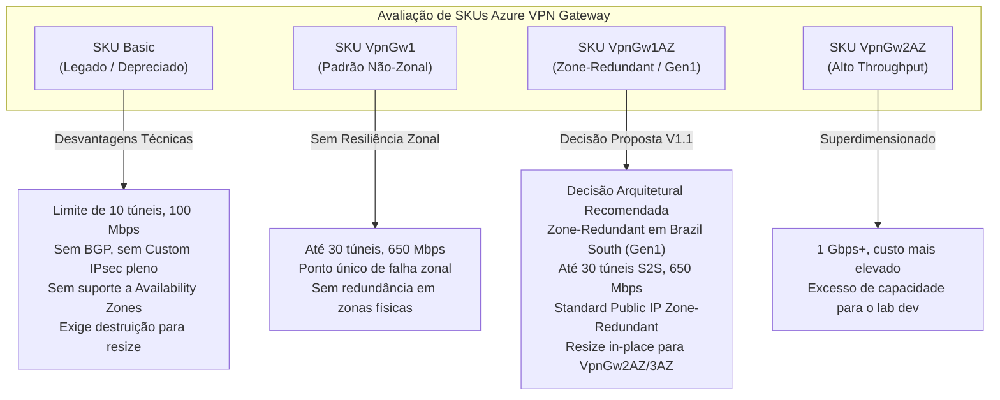
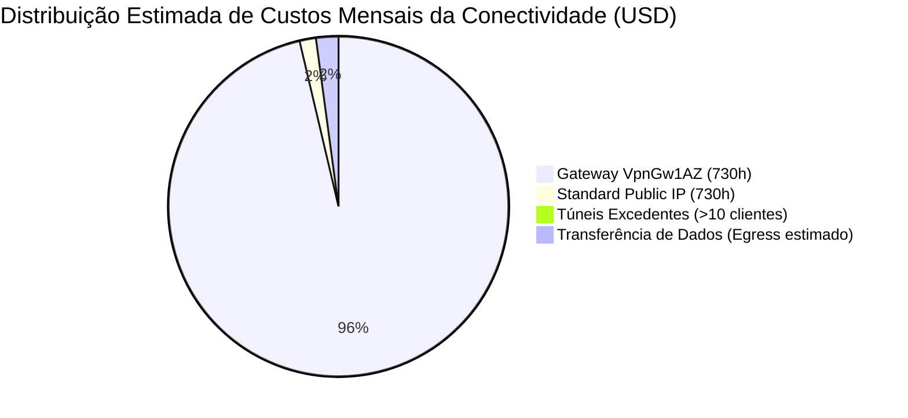

# ADR-001: Seleção do SKU do Azure Virtual Network Gateway para o Ambiente Dev

- **Status**: Revisado e Proposto para Aprovação Humana (Revisão Arquitetural V1.1)
- **Data da Última Revisão**: 2026-10-09
- **Data Original**: 2026-10-02
- **Autor / Papel**: Cloud Architect — Azure Monitoring Hub
- **Contexto da História**: [US-05: Provisionamento do Azure Virtual Network Gateway Compartilhado](file:///C:/Users/drlim/ENTERPRISE-CLOUD-CASE-STUDIES/azure-monitoring-hub/docs/backlog/BACKLOG.md#us-05-provisionamento-do-azure-virtual-network-gateway-compartilhado)
- **Documento Relacionado**: [ARCHITECTURE.md](file:///C:/Users/drlim/ENTERPRISE-CLOUD-CASE-STUDIES/azure-monitoring-hub/docs/architecture/ARCHITECTURE.md)

---

## 1. Contexto e Problema

O projeto **Azure Monitoring Hub** (`monhub`) adota uma topologia de rede centralizada (*Hub Network* híbrida) na qual múltiplos clientes fictícios conectam suas redes locais remotas à infraestrutura de monitoramento hospedada no Microsoft Azure através de túneis VPN Site-to-Site (S2S).

Conforme estabelecido em [PROJECT.md](file:///C:/Users/drlim/ENTERPRISE-CLOUD-CASE-STUDIES/azure-monitoring-hub/PROJECT.md), [SECURITY.md](file:///C:/Users/drlim/ENTERPRISE-CLOUD-CASE-STUDIES/azure-monitoring-hub/SECURITY.md) e na [US-05](file:///C:/Users/drlim/ENTERPRISE-CLOUD-CASE-STUDIES/azure-monitoring-hub/docs/backlog/BACKLOG.md#us-05-provisionamento-do-azure-virtual-network-gateway-compartilhado):
1. O Azure Virtual Network Gateway (**VNG**) é um componente compartilhado entre todos os clientes (`vng-monhub-dev-brs`);
2. Cada cliente atendido possui seu respectivo coletor dedicado em `snet-collectors-dev-brs`, comunicando-se com sua rede remota através de uma conexão VPN dedicada (`con-cust<ID>-dev-brs`) e um Local Network Gateway próprio (`lng-cust<ID>-dev-brs`);
3. As conexões VPN devem operar obrigatoriamente sob o protocolo **IKEv2** e roteamento **Route-Based**;
4. Os coletores não possuem IP público; o único componente de trânsito com endereço público é o próprio gateway central de VPN;
5. O ambiente inicial de execução é `dev`, localizado na região **Brazil South** (`rg-monhub-dev-brs`), operando como laboratório técnico e estudo de caso corporativo com foco em governança, segurança e controle orçamentário (FinOps).

### O Problema
É necessário definir e validar tecnicamente a especificação arquitetural do **SKU do Virtual Network Gateway** para o ambiente de desenvolvimento, equilibrando de forma ótima:
- Capacidade de suportar até 30 túneis VPN Site-to-Site simultâneos;
- Resiliência e alta disponibilidade adequadas para um gateway compartilhado multi-cliente via Availability Zones;
- Compatibilidade regional comprovada na região **Brazil South** (`brazilsouth`);
- Compatibilidade total com a `GatewaySubnet` existente (`10.240.0.0/26`);
- Integração mandatória com Standard Public IP zone-redundant;
- Estimativa orçamentária detalhada e transparente de custos mensais em Brazil South;
- Aderência às melhores práticas de segurança e alinhamento com os papéis do Security Engineer e Cloud DevOps Engineer.

---

## 2. Requisitos e Restrições Arquiteturais

| Dimensão | Requisito do Projeto | Restrição / Impacto Arquitetural |
| :--- | :--- | :--- |
| **Tipo de Gateway** | `Vpn` | Obrigatório para terminação de túneis IPsec/IKE Site-to-Site. |
| **Tipo de Roteamento** | `RouteBased` | Mandatório para múltiplos túneis S2S simultâneos e políticas IKEv2 dinâmicas. |
| **Protocolo VPN** | `IKEv2` | Requisito explícito de segurança e governança (IKEv1 descontinuado/desaconselhado). |
| **Geração do Gateway** | `Generation1` | Baseline técnica estabelecida para equilíbrio de custo e suporte pleno à família VpnGw1. |
| **SKU Selecionado** | `VpnGw1AZ` | Variante resiliente a zonas de disponibilidade (*Zone-Redundant*), provendo 650 Mbps e até 30 túneis S2S. |
| **Região de Implantação** | Brazil South (`brazilsouth`) | Região primária com suporte oficial a 3 Availability Zones para recursos de rede. |
| **Subnet Alocada** | `GatewaySubnet` (`10.240.0.0/26`) | Bloco de 64 IPs alocado em [ARCHITECTURE.md](file:///C:/Users/drlim/ENTERPRISE-CLOUD-CASE-STUDIES/azure-monitoring-hub/docs/architecture/ARCHITECTURE.md), superando o mínimo de `/27` recomendado pela Microsoft. |
| **Endereço IP Público** | Standard Public IP (Zone-Redundant) | Requisito mandatório para gateways do tipo `*AZ`; alocação estática. |
| **Políticas de Criptografia** | Delegação ao Security Engineer | O SKU deve suportar parâmetros customizados de IPsec/IKE (Phase 1 e Phase 2). |
| **Segregação de Papéis** | Sem código ou execução direta | Cloud Architect documenta decisões e handoffs; implementação via Cloud DevOps e revisão via Security Engineer. |

---

## 3. Análise Comparativa dos SKUs Candidatos

### 3.1 Tabela Comparativa Detalhada

| Critério / Funcionalidade | `Basic` | `VpnGw1` | `VpnGw1AZ` *(Proposto)* | `VpnGw2AZ` |
| :--- | :--- | :--- | :--- | :--- |
| **Geração Técnica** | Legado | Generation 1 | **Generation 1** | Generation 1 |
| **Throughput Agregado** | 100 Mbps | 650 Mbps | **650 Mbps** | 1 Gbps |
| **Capacidade Máxima de Túneis S2S** | Até 10 túneis | Até 30 túneis | **Até 30 túneis** | Até 30 túneis |
| **Suporte a IKEv2** | Limitado (políticas fixas) | Suporte completo | **Suporte completo** | Suporte completo |
| **Políticas Customizadas IPsec/IKE** | Não suportado / Restrito | Suportado nativamente | **Suportado nativamente** | Suportado nativamente |
| **SKU de IP Público Suportado** | Basic / Standard | Standard Public IP | **Standard Public IP (Zone-Redundant)** | Standard Public IP (Zone-Redundant) |
| **Redundância Zonal (Availability Zones)** | Não | Não | **Sim (Zone-Redundant em 3 Zonas)** | Sim (Zone-Redundant em 3 Zonas) |
| **Suporte a BGP (Roteamento Dinâmico)** | Não | Suportado | **Suportado** | Suportado |
| **Capacidade de Resize In-Place** | Não (exige recriação) | Sim (para VpnGw2/3) | **Sim (para VpnGw2AZ/3AZ)** | Sim (para VpnGw3AZ) |
| **Custo Relativo Mensal** | Baixo (~$26) | Moderado (~$140) | **Moderado-Alto (~$210-$245 em BRS)** | Alto (~$380+) |

---

## 4. Avaliação Crítica das Alternativas

### 4.1 Por que o SKU `Basic` foi descartado?
1. **Incompatibilidade com Requisitos de Segurança**: O SKU `Basic` não aceita políticas completas de criptografia customizada de IPsec/IKE. Como o projeto delega ao Security Engineer a definição de cifras fortes (Phase 1 e Phase 2), o `Basic` inviabilizaria os guardrails de segurança corporativa.
2. **Capacidade Reduzida de Túneis**: O limite estrito de 10 túneis S2S impede a meta arquitetural de suportar até 30 clientes no gateway compartilhado.
3. **Ausência de Suporte a BGP e Zonas**: O SKU `Basic` não oferece BGP, não possui redundância zonal e não suporta redimensionamento (*resize*) para SKUs superiores sem destruição e recriação total do recurso.

### 4.2 Por que priorizar `VpnGw1AZ` frente ao `VpnGw1` não-zonal?
1. **Resiliência do Ponto Central de Trânsito**: O gateway é um recurso compartilhado por todos os clientes da plataforma. Caso uma zona física de datacenter em Brazil South enfrente indisponibilidade de energia ou conectividade, o gateway padrão não-zonal ficaria fora do ar, derrubando a monitoração de todos os clientes simultaneamente. A implantação zone-redundant distribui o gateway através das Availability Zones da região, mitigando pontos únicos de falha física.
2. **Padrão de Referência Corporativo**: Por se tratar de um estudo de caso corporativo representativo, adotar redundância zonal desde o desenho base reflete a conformidade com o *Azure Well-Architected Framework* (pilar de Confiabilidade).

### 4.3 Por que descartar o SKU `VpnGw2AZ` nesta etapa?
1. O throughput de 1 Gbps a 1.25 Gbps excede com folga excessiva as necessidades de tráfego de telemetria WMI, SNMP, WinRM e ICMP geradas pelos coletores no ambiente de estudo.
2. O custo mensal seria aproximadamente 60% a 70% superior ao do `VpnGw1AZ`, sem qualquer benefício técnico perceptível para a carga de trabalho de desenvolvimento.

---

## 5. Decisão Arquitetural Consolidada para V1.1

Define-se oficialmente a seguinte especificação técnica para o Azure Virtual Network Gateway no ambiente **dev**:

> ### **Especificação Técnica Oficial: `vng-monhub-dev-brs`**
>
> - **Nome do Gateway**: `vng-monhub-dev-brs`
> - **Resource Group**: `rg-monhub-dev-brs` (consumido via data source)
> - **Região**: Brazil South (`brazilsouth`)
> - **Gateway Type**: `Vpn`
> - **VPN Type**: `RouteBased`
> - **SKU**: **`VpnGw1AZ`**
> - **Generation**: **`Generation1`**
> - **Capacidade de Túneis S2S**: **Até 30 túneis** IPsec/IKEv2 simultâneos
> - **Throughput Agregado de Referência**: 650 Mbps
> - **Protocolo de Conectividade**: Mandatório **IKEv2** em todas as conexões
> - **Suporte a BGP**: Habilitado / Suportado (ASN base a ser configurado quando aplicável)
> - **Redundância Zonal**: Zone-Redundant (distribuído nas Zonas de Disponibilidade de Brazil South)
> - **Subnet Vinculada**: `GatewaySubnet` (`10.240.0.0/26`) dentro de `vnet-monhub-dev-brs`
> - **Endereço IP Público**: `pip-vng-monhub-dev-brs` (SKU `Standard`, alocação `Static`, Zone-Redundant)

### 5.1 Validação de Disponibilidade Regional em Brazil South
- A região **Brazil South** (`brazilsouth`, São Paulo) conta com suporte oficial à disponibilidade de Zonas de Disponibilidade (Availability Zones 1, 2 e 3).
- O SKU `VpnGw1AZ` (Generation 1) e o SKU `Standard` de Public IP possuem disponibilidade geral homologada na região `brazilsouth`.
- A arquitetura zone-redundant não exige fixar uma zona específica (ex.: `zones = ["1"]`), mas sim alocar o gateway e o IP público em modo zone-redundant pela plataforma, garantindo failover automático transparente entre zonas físicas.

### 5.2 Validação e Compatibilidade da `GatewaySubnet` Existente
- **Endereçamento Aprovado**: `10.240.0.0/26` (64 IPs totais, sendo 59 endereços disponíveis pela plataforma Azure).
- **Recomendação Oficial da Microsoft**: A documentação oficial do Azure recomenda uma subnet mínima de `/27` (32 IPs) para acomodar a implantação de gateways VPN modernos e garantir margem para transições de manutenção ou configurações ativo-ativo.
- **Avaliação de Compatibilidade**: O bloco alocado `/26` provê exatamente o dobro da capacidade recomendada pela Microsoft, garantindo folga total para o `VpnGw1AZ` e prevenindo qualquer necessidade de expansão ou recriação futura de subnets.
- **Regras de Isolamento**:
  - A `GatewaySubnet` não deve possuir nenhum Network Security Group (NSG) associado;
  - Nenhuma User-Defined Route (UDR) que intercepte portas de controle do gateway deve ser associada à subnet;
  - Nenhuma máquina virtual ou outro serviço deve ser implantado dentro da `GatewaySubnet`.

### 5.3 Validação e Especificação do Public IP (`pip-vng-monhub-dev-brs`)
- **SKU Obrigatório**: `Standard` (obrigatório para gateways zone-redundant `*AZ`; SKUs `Basic` de IP não são permitidos pelo Azure para este tipo de gateway).
- **Método de Alocação**: Estático (`Static`).
- **Redundância**: Zone-Redundant (sem fixação em uma única zona, permitindo resiliência zonal em Brazil South).
- **Isolamento de Segurança**: Este é o **único endereço IP público** provisionado na infraestrutura de conectividade do hub. Os coletores Windows dedicados operam exclusivamente com IPs privados estáticos em `snet-collectors-dev-brs`.

### 5.4 Capacidade de Túneis Site-to-Site (Até 30 Túneis S2S)
- O SKU `VpnGw1AZ` atende integralmente ao teto de dimensionamento de até **30 túneis VPN Site-to-Site simultâneos**.
- Essa capacidade comporta os clientes iniciais do laboratório (`cust01`, `cust02`, `cust03`) e viabiliza a expansão escalável para dezenas de clientes sem requerer alterações arquiteturais ou de SKU.

---

## 6. Modelagem Financeira e Estimativa de Custos Mensais (FinOps — Brazil South)

A estimativa orçamentária para a região **Brazil South** baseia-se na tabela de preços vigentes da Microsoft Azure (valores de referência em Dólares Americanos - USD, regime de cobrança horária):

### 6.1 Detalhamento de Custos da Infraestrutura de Conectividade

| Componente | Métrica / Quantidade | Custo Unitário Estimado (BRS) | Custo Mensal Estimado (730h) | Observações FinOps |
| :--- | :--- | :--- | :--- | :--- |
| **Virtual Network Gateway (`VpnGw1AZ`)** | 1 gateway ativo contínuo | ~$0.310 / hora | **~$226.30 USD** | Faturado por hora enquanto provisionado. Inclui os primeiros 10 túneis S2S. |
| **Standard Public IP (Zone-Redundant)** | 1 endereço IP estático | ~$0.005 / hora | **~$3.65 USD** | Faturado por hora de alocação no Resource Group. |
| **Túneis VPN S2S (Clientes Iniciais 1 a 10)** | Até 10 túneis simultâneos | **Incluso ($0.00 / h)** | **$0.00 USD** | Os primeiros 10 túneis VPN estão inclusos na tarifa base do gateway. |
| **Túneis VPN S2S Adicionais (Clientes 11 a 30)** | Por túnel conectado (> 10) | ~$0.015 / túnel / hora | ~$10.95 USD / túnel / mês | Aplicável apenas quando o laboratório exceder 10 conexões ativas. |
| **Transferência de Dados de Saída (Egress)** | Telemetria e polling | Primeiros 100 GB gratuitos; ~$0.15 / GB excedente | **~$2.00 a $5.00 USD** | A maioria do tráfego de monitoramento é Ingress (gratuito). Egress ocorre apenas em requisições de polling. |
| **Total Mensal Estimado da Conectividade** | Operação Contínua (24/7) | — | **~$232.00 a ~$245.00 USD / mês** | Custo focado estritamente no hub de rede e trânsito VPN compartilhado. |

### 6.2 Estratégias e Recomendações de Otimização Orçamentária para o Ambiente Dev
1. **Provisionamento sob Demanda (IaC Lifecycle)**:
   - Em ambiente de laboratório estritamente acadêmico ou de portfólio, manter o gateway ativo 24/7 consome cerca de $230 USD/mês.
   - O provisionamento via pipeline do Terraform pode ser planejado para ciclos de validação e testes práticos, mitigando custos quando a infraestrutura não estiver em uso ativo.
   - *Nota de Trade-off*: Um Azure Virtual Network Gateway leva entre 25 e 45 minutos para provisionar ou destruir na plataforma Azure. Para rotinas diárias de desenvolvimento ágil, manter o gateway ativo durante a fase de sprints de teste é recomendado para viabilizar testes imediatos de túneis.
2. **Monitoramento e Alertas de Custo**:
   - Recomenda-se a ativação de alertas de orçamento (*Azure Cost Management Budgets*) com thresholds em 50%, 80% e 100% do orçamento previsto para `rg-monhub-dev-brs`.

---

## 7. Boas Práticas e Diretrizes de Segurança

Para atender aos princípios de Zero Trust e Defense in Depth descritos em [SECURITY.md](file:///C:/Users/drlim/ENTERPRISE-CLOUD-CASE-STUDIES/azure-monitoring-hub/SECURITY.md), as seguintes diretrizes são mandatórias:

### 7.1 Protocolo IKEv2 Obrigatório
- Todas as conexões VPN Site-to-Site (`con-cust<ID>-dev-brs`) devem ser configuradas exclusivamente com protocolo **IKEv2**.
- O protocolo IKEv1 não deve ser aceito, assegurando maior resiliência contra ataques de integridade e garantindo suporte a múltiplas SAs por túnel.

### 7.2 Isolamento Inter-Cliente (Prevenção de Trânsito Indevido Spoke-to-Spoke)
- O Virtual Network Gateway opera como concentrador de conexões de múltiplos clientes concorrentes.
- **Risco Identificado**: Em configurações inadequadas de roteamento, o tráfego da rede remota do Cliente A poderia transitar pelo gateway do Azure em direção à rede remota do Cliente B.
- **Controle de Mitigação Arquitetural**:
  1. A arquitetura adota topologia estrita sem trânsito entre clientes (*No Inter-Customer Transit*);
  2. BGP não deve propagar prefixos de um cliente para os Local Network Gateways de outros clientes;
  3. No nível dos coletores, as regras de NSG em `snet-collectors-dev-brs` e os ASGs dedicados por cliente (`asg-cust<ID>-dev-brs`) impedem movimentação lateral interna.

### 7.3 Diretrizes de Segurança da `GatewaySubnet`
- Conforme recomendação da Microsoft, **não associar NSG à `GatewaySubnet`**.
- O isolamento e a proteção de tráfego são executados estritamente na subnet dos coletores (`nsg-collectors-dev-brs`), onde regras granulares filtram portas e origens autorizadas.

### 7.4 Handoff de Parâmetros Criptográficos para o Security Engineer
- A definição das políticas criptográficas detalhadas é de responsabilidade exclusiva do **Security Engineer**.
- O SKU `VpnGw1AZ` suporta plenamente o bloco `ipsec_policy` no Terraform, permitindo a especificação dos seguintes parâmetros homologados:
  - Phase 1 (IKE SA): Criptografia (ex.: AES256), Integridade (ex.: SHA256/SHA384), DH Group (ex.: DHGroup14 ou DHGroup24), Lifetime (ex.: 28800s);
  - Phase 2 (IPsec SA): Criptografia (ex.: GCMAES256 ou AES256), Integridade (ex.: GCMAES256 ou SHA256), PFS Group (ex.: PFS14 ou PFS24), Lifetime (ex.: 3600s a 7200s).

### 7.5 Gestão Segura de Pre-Shared Keys (PSK)
- Nenhuma chave compartilhada (PSK) deve constar em texto claro no código Terraform ou em documentação versionada no Git.
- As PSKs devem ser geradas com alta entropia (cadeia pseudoaleatória de no mínimo 32 caracteres) e injetadas via segredos protegidos do GitHub Actions ou Azure Key Vault durante o pipeline da US-07.

---

## 8. Consequências e Impactos na Arquitetura

### 8.1 Impactos Positivos
- **Alta Resiliência Zonal**: O hub de conectividade passa a ser imune a falhas em uma zona de disponibilidade única em Brazil South.
- **Capacidade e Escalabilidade**: Suporta confortavelmente até 30 clientes conectados com 650 Mbps de throughput compartilhado.
- **Compatibilidade Nativa com IaC**: O recurso é totalmente suportado pelo provider Terraform `azurerm` (`azurerm_virtual_network_gateway`) sem necessidade de workarounds ou provisioners externos.
- **Caminho de Crescimento Transparente**: Caso haja necessidade futura de maior throughput, o gateway suporta redimensionamento *in-place* para `VpnGw2AZ` sem necessidade de destruir as conexões configuradas.

### 8.2 Riscos Identificados e Mitigações

| Risco Identificado | Severidade | Mitigação Arquitetural |
| :--- | :--- | :--- |
| **Tempo Prolongado de Provisionamento** (25 a 45 min) | Média | Planejar janelas de execução no pipeline de CI/CD e evitar destruição/recriação frequente do recurso. |
| **Custo Contínuo em Nuvem** (~$230/mês) | Alta (FinOps) | Estabelecer controle rigoroso de billing, aprovação humana obrigatória via GitHub Environment antes do apply e revisão contínua. |
| **Conflito de CIDR entre Clientes e a VNet** | Crítica | Execução mandatória do script de validação de overlap de CIDR (US-06) antes do provisionamento de qualquer conexão. |
| **Exposição Acidental de Segredos (PSK) no State** | Alta | Backend remoto seguro com RBAC estrito e criptografia (US-01); o estado nunca é versionado no Git. |

---

## 9. Matriz de Decisões, Pendências e Handoffs para Aprovação Humana

Para garantir governança, segregação de papéis e estrito controle de alterações privilegiadas, as seguintes decisões e pendências técnicas são submetidas para aprovação humana:

| # | Item / Decisão | Papel Responsável | Status | Descrição da Decisão / Pendência para Validação |
| :-: | :--- | :--- | :--- | :--- |
| **1** | **Aprovação do SKU `VpnGw1AZ` e Geração 1** | Usuário / PO / Architect | **Pendente de Aprovação Humana** | Formalizar o SKU `VpnGw1AZ` (Gen1, Zone-Redundant, 650 Mbps, até 30 túneis) como baseline oficial para o gateway compartilhado em Brazil South. |
| **2** | **Aprovação do Compromisso Orçamentário FinOps** | Usuário / Sponsor | **Pendente de Aprovação Humana** | Aprovar o custo mensal estimado de ~$230.00 a ~$245.00 USD/mês para o gateway compartilhado e IP público em regime contínuo, ou definir política de destruição sob demanda. |
| **3** | **Validação Prévia de Cota / Capacidade em Brazil South** | Cloud DevOps Engineer | **Pendente Operacional** | Executar consulta somente leitura (`az network vnet-gateway list-skus --location brazilsouth`) confirmando ausência de restrições de cota para `VpnGw1AZ` na subscription antes da US-05. |
| **4** | **Especificação da Política Criptográfica (IPsec/IKE)** | Security Engineer | **Pendente de Especificação** | Definir cifras, integridade e Diffie-Hellman groups para o bloco `ipsec_policy` das conexões IKEv2 (US-05 e US-07). |
| **5** | **Implementação do Módulo Terraform do VNG (US-05)** | Cloud DevOps Engineer | **Pendente de Implementação** | Desenvolver o código modular em `terraform/` consumindo a `GatewaySubnet` e o Public IP Standard Zone-Redundant, sem executar `apply` sem gate humano. |
