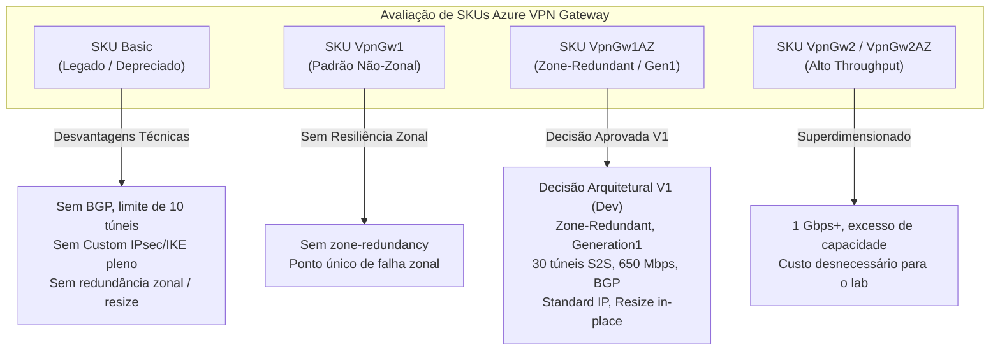

# ADR-001: Seleção do SKU do Azure Virtual Network Gateway para o Ambiente Dev

- **Status**: Aprovado (Decisão Arquitetural V1)
- **Data**: 2026-10-02
- **Autor / Papel**: Cloud Architect — Azure Monitoring Hub
- **Contexto da História**: [US-05: Provisionamento do Azure Virtual Network Gateway Compartilhado](file:///C:/Users/drlim/ENTERPRISE-CLOUD-CASE-STUDIES/azure-monitoring-hub/docs/backlog/BACKLOG.md#us-05-provisionamento-do-azure-virtual-network-gateway-compartilhado)
- **Documento Relacionado**: [ARCHITECTURE.md](file:///C:/Users/drlim/ENTERPRISE-CLOUD-CASE-STUDIES/azure-monitoring-hub/docs/architecture/ARCHITECTURE.md)

---

## 1. Contexto e Problema

O projeto **Azure Monitoring Hub** (`monhub`) adota uma topologia de rede centralizada (*Hub-and-Spoke* híbrida) em que múltiplos clientes fictícios conectam suas redes locais remotas à infraestrutura de monitoramento hospedada no Microsoft Azure através de túneis VPN Site-to-Site (S2S).

Conforme estabelecido em [PROJECT.md](file:///C:/Users/drlim/ENTERPRISE-CLOUD-CASE-STUDIES/azure-monitoring-hub/PROJECT.md) e na [US-05](file:///C:/Users/drlim/ENTERPRISE-CLOUD-CASE-STUDIES/azure-monitoring-hub/docs/backlog/BACKLOG.md#us-05-provisionamento-do-azure-virtual-network-gateway-compartilhado):
1. O Azure Virtual Network Gateway (**VNG**) é um recurso compartilhado entre todos os clientes (`vng-monhub-dev-brs`);
2. Cada cliente atendido possui seu respectivo coletor dedicado em `snet-collectors-dev-brs`, comunicando-se com sua rede remota através de uma conexão VPN dedicada (`con-cust<ID>-dev-brs`) e um Local Network Gateway próprio (`lng-cust<ID>-dev-brs`);
3. As conexões VPN devem operar sob o protocolo **IKEv2** e roteamento **Route-Based**;
4. O ambiente inicial de execução é `dev`, localizado na região **Brazil South** (`rg-monhub-dev-brs`), operando como laboratório técnico de portfólio corporativo.

### O Problema
É necessário definir tecnicamente o **SKU do Virtual Network Gateway** para o ambiente de desenvolvimento, equilibrando de forma ótima:
- Capacidade de suportar múltiplos túneis VPN Site-to-Site simultâneos;
- Resiliência e alta disponibilidade adequadas para um gateway compartilhado multi-cliente;
- Compatibilidade nativa com IKEv2 e suporte a políticas criptográficas customizadas;
- Adoção de Standard Public IP e recursos modernos da plataforma Azure;
- Suporte a BGP e flexibilidade para evolução futura sem necessidade de recriação destrutiva.

---

## 2. Requisitos e Restrições Arquiteturais

| Dimensão | Requisito do Projeto | Restrição / Impacto |
| :--- | :--- | :--- |
| **Tipo de Gateway** | VPN Gateway | Tipo obrigatório para terminação IPsec/IKE S2S. |
| **Tipo de Roteamento** | Route-Based | Obrigatório para suporte a múltiplos túneis S2S simultâneos e IKEv2 flexível. |
| **Protocolo VPN** | IKEv2 | Requisito explícito de segurança e governança. |
| **Geração do Gateway** | Generation 1 | Baseline técnica estabelecida para o gateway. |
| **Topologia** | Multi-Customer Compartilhado | O gateway deve suportar as conexões de clientes fictícios (`cust01`, `cust02`, etc.) e escalar com margem operacional. |
| **Resiliência** | Zone-Redundant | Gateway distribuído entre zonas de disponibilidade da região para proteção contra falhas zonais. |
| **Políticas de Criptografia** | Delegação ao Security Engineer | O SKU escolhido deve suportar parâmetros customizados de IPsec/IKE (Phase 1 e Phase 2), os quais serão especificados pelo Security Engineer. |
| **Endereçamento** | `GatewaySubnet` (`10.240.0.0/26`) | Bloco /26 aprovado em [ARCHITECTURE.md](file:///C:/Users/drlim/ENTERPRISE-CLOUD-CASE-STUDIES/azure-monitoring-hub/docs/architecture/ARCHITECTURE.md), compatível com qualquer SKU de VNG. |

---

## 3. Análise Comparativa dos SKUs Candidatos

Foram avaliados os SKUs da família de VPN Gateways do Azure pertinentes ao contexto do laboratório:

### 3.1 Tabela Comparativa Detalhada

| Critério / Funcionalidade | `Basic` | `VpnGw1` | `VpnGw1AZ` | `VpnGw2` / `VpnGw2AZ` |
| :--- | :--- | :--- | :--- | :--- |
| **Geração Técnica** | Legado | Generation 1 | **Generation 1** | Generation 1 |
| **Throughput Agregado** | 100 Mbps | 650 Mbps | **650 Mbps** | 1 Gbps |
| **Máximo de Túneis S2S** | Até 10 túneis | Até 30 túneis | **Até 30 túneis** | Até 30 túneis |
| **Suporte a IKEv2** | Limitado (políticas fixas) | Suporte completo | **Suporte completo** | Suporte completo |
| **Políticas Customizadas IPsec/IKE** | Não suportado / Restrito | Suportado nativamente | **Suportado nativamente** | Suportado nativamente |
| **SKU de IP Público Suportado** | Standard Public IP | Standard Public IP | **Standard Public IP (Zone-redundant)** | Standard Public IP |
| **Redundância Zonal (Availability Zones)** | Não | Não | **Sim (Zone-redundant)** | Sim (na variante AZ) |
| **Suporte a BGP (Roteamento Dinâmico)** | Não | Suportado | **Suportado** | Suportado |
| **Capacidade de Resize In-Place** | Não (exige recriação) | Sim (para VpnGw2/3) | **Sim (para VpnGw2AZ/3AZ)** | Sim (para VpnGw3/3AZ) |

---

## 4. Avaliação Crítica das Alternativas

### 4.1 Por que descartar o SKU `Basic`?
1. **Ausência de Suporte a BGP**: O SKU `Basic` não oferece suporte a BGP (Border Gateway Protocol), impossibilitando o uso de roteamento dinâmico entre o gateway compartilhado e as redes remotas dos clientes.
2. **Bloqueio de Políticas Criptográficas Customizadas**: O SKU `Basic` não aceita políticas customizadas de IPsec/IKE completas. Como o projeto delega ao Security Engineer ([US-05](file:///C:/Users/drlim/ENTERPRISE-CLOUD-CASE-STUDIES/azure-monitoring-hub/docs/backlog/BACKLOG.md#us-05-provisionamento-do-azure-virtual-network-gateway-compartilhado) e [US-07](file:///C:/Users/drlim/ENTERPRISE-CLOUD-CASE-STUDIES/azure-monitoring-hub/docs/backlog/BACKLOG.md#us-07-módulo-parametrizado-de-conectividade-vpn-por-cliente)) a especificação de parâmetros seguros de Phase 1 e Phase 2, o SKU `Basic` representaria uma restrição técnica inaceitável.
3. **Limitação de Escala e Ausência de Redundância Zonal**: O SKU `Basic` suporta apenas até 10 túneis S2S, throughput máximo de 100 Mbps, não oferece zone-redundancy e não suporta redimensionamento (*resize*) para SKUs superiores da família `VpnGw` sem destruição e recriação completa do recurso.

### 4.2 Por que priorizar `VpnGw1AZ` frente ao `VpnGw1` não-zonal?
1. **Ponto Central de Falha**: O Virtual Network Gateway é um recurso compartilhado que concentra o tráfego de monitoramento de todos os clientes da plataforma. A adoção de redundância zonal (`Zone-redundant`) assegura que o gateway seja instanciado através de diferentes Availability Zones físicas, eliminando a dependência de uma única zona física de datacenter.
2. **Fidelidade a Padrões Enterprise**: Como este projeto compõe um caso de estudo de portfólio corporativo de alta relevância, o desenho de arquitetura deve refletir as melhores práticas recomendadas pelo *Azure Well-Architected Framework* para serviços de trânsito centralizados desde o ambiente de desenvolvimento.

### 4.3 Por que descartar `VpnGw2` / `VpnGw2AZ`?
1. O throughput de 1 Gbps a 1.25 Gbps excede largamente o tráfego gerado pela telemetria dos coletores de monitoramento no escopo do laboratório.
2. Gera custos adicionais injustificados para a fase atual do projeto.

---

## 5. Decisão Arquitetural Aprovada para a V1

Adota-se oficialmente para o ambiente **dev** do projeto **Azure Monitoring Hub** a seguinte especificação técnica:

> ### **`VpnGw1AZ`** (Generation 1)
> - **Gateway Type**: `Vpn`
> - **VPN Type**: `RouteBased`
> - **SKU**: `VpnGw1AZ`
> - **Generation**: `Generation1`
> - **Throughput Agregado de Referência**: 650 Mbps
> - **Capacidade de Túneis**: Até 30 túneis S2S / VNet-to-VNet
> - **Suporte a BGP**: Sim (habilitado/suportado)
> - **Zone-Redundant**: Sim
> - **Public IP**: `pip-vng-monhub-dev-brs` (SKU `Standard`, Zone-Redundant, alocação estática)

### 5.1 Justificativa Técnica da Escolha
1. **Atendimento Pleno à US-05**: Suporte nativo a IKEv2 com terminação Route-Based centralizada e estável.
2. **Resiliência com Redundância Zonal**: Distribuição das instâncias do gateway em zonas de disponibilidade (Availability Zones), assegurando alta disponibilidade arquitetural para o hub compartilhado.
3. **Capacidade Adequada**: Suporta até 30 conexões VPN simultâneas, comportando os clientes fictícios iniciais (`cust01`, `cust02`) e expansões com folga.
4. **Throughput de Referência**: Banda agregada de 650 Mbps, compatível com a demanda de tráfego de monitoramento.
5. **Handoff Seguro com o Security Engineer**: Suporte total à especificação de políticas criptográficas customizadas (`ipsec_policy`) pelo Security Engineer.
6. **Modernidade**: Uso mandatório de Standard Public IP zone-redundant, evitando recursos legados.
7. **Suporte a BGP e Expansão**: Permite ativação de BGP para roteamento dinâmico futuro e possibilita redimensionamento *in-place* para `VpnGw2AZ`/`VpnGw3AZ`.

---

## 6. Consequências e Impactos na Arquitetura

### 6.1 Impactos Positivos
- **Resiliência Arquitetural**: O hub de trânsito compartilhado passa a ser resiliente a indisponibilidades zonais.
- **Conformidade com Melhores Práticas**: Alinhamento com arquiteturas corporativas modernas no Microsoft Azure.
- **Suporte Terraform**: Mapeamento nativo e estável no provider `azurerm` através do recurso `azurerm_virtual_network_gateway` com `sku = "VpnGw1AZ"` e `generation = "Generation1"`.

### 6.2 Governança e Custos
- A tarifação do gateway `VpnGw1AZ` e de seu IP público Standard zone-redundant é horária.
- Recomenda-se a utilização de automação de IaC com aprovação controlada e acompanhamento de custos via Azure Cost Management.

---

## 7. Pendências de Validação Operacional (Handoffs)

1. **Validação de Preços Correntes (Billing/Financeiro)**:
   - A equipe de DevOps / Usuário deve aferir os valores tarifários atualizados na [Calculadora de Preços do Azure](https://azure.microsoft.com/pricing/calculator/) para o SKU `VpnGw1AZ` na região `Brazil South` antes do provisionamento em nuvem.
2. **Validação de Disponibilidade Efetiva em Brazil South**:
   - Durante a fase preparatória de implantação da US-05, o Cloud DevOps Engineer deverá confirmar via portal ou query somente leitura (`az network vnet-gateway list-skus --location brazilsouth`) a disponibilidade do SKU `VpnGw1AZ` e das Availability Zones para a assinatura na região `Brazil South`.
3. **Definição das Políticas Criptográficas (Security Engineer)**:
   - O Security Engineer deverá prover a especificação de parâmetros IPsec/IKE (cifras de criptografia, integridade, grupos Diffie-Hellman e lifetimes de Phase 1/Phase 2) para inclusão no bloco de políticas da conexão VPN na US-05 e US-07.
