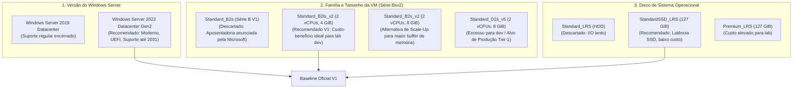

# ADR-002: Baseline Arquitetural do Host Windows Server dos Collectors

- **Status**: Aprovado (Decisão Arquitetural V1)
- **Data**: 2026-10-02
- **Autor / Papel**: Cloud Architect — Azure Monitoring Hub
- **Contexto da História**: [US-09: Definição Arquitetural do Host Windows Server dos Collectors](file:///C:/Users/drlim/ENTERPRISE-CLOUD-CASE-STUDIES/azure-monitoring-hub/docs/backlog/BACKLOG.md#us-09-definição-arquitetural-do-host-windows-server-dos-collectors)
- **Documento Relacionado**: [ARCHITECTURE.md](file:///C:/Users/drlim/ENTERPRISE-CLOUD-CASE-STUDIES/azure-monitoring-hub/docs/architecture/ARCHITECTURE.md)

---

## 1. Contexto e Problema

O projeto **Azure Monitoring Hub** (`monhub`) adota uma arquitetura multi-customer em que cada cliente fictício dispõe de uma máquina virtual dedicada para a execução de um coletor de monitoramento (ex.: Zabbix Proxy, PRTG Remote Probe, Dynatrace ActiveGate ou agente equivalente de telemetria WMI/SNMP/WinRM/ICMP).

Conforme estabelecido em [PROJECT.md](file:///C:/Users/drlim/ENTERPRISE-CLOUD-CASE-STUDIES/azure-monitoring-hub/PROJECT.md), [SECURITY.md](file:///C:/Users/drlim/ENTERPRISE-CLOUD-CASE-STUDIES/azure-monitoring-hub/SECURITY.md) e na [US-09](file:///C:/Users/drlim/ENTERPRISE-CLOUD-CASE-STUDIES/azure-monitoring-hub/docs/backlog/BACKLOG.md#us-09-definição-arquitetural-do-host-windows-server-dos-collectors):
1. Cada cliente atendido possui 1 VM dedicada hospedada na subnet de collectors (`snet-collectors-dev-brs`);
2. As VMs de collector **não possuem endereço IP público** (`public_ip_address_id = null`);
3. A interface de rede (NIC) de cada VM utiliza um endereço **IP privado estático** e é vinculada exclusivamente ao Application Security Group (ASG) dedicado do cliente (`asg-cust<ID>-dev-brs`);
4. A comunicação dos coletores com os alvos monitorados nas redes remotas dos clientes ocorre exclusivamente através dos túneis VPN Site-to-Site IKEv2 terminados no gateway central compartilhado (`vng-monhub-dev-brs`);
5. O ambiente inicial de execução é `dev` na região **Brazil South** (`rg-monhub-dev-brs`), operando como laboratório técnico de portfólio corporativo com necessidade de estrito controle orçamentário (FinOps).

### O Problema
É necessário definir tecnicamente a especificação padrão (*baseline*) do host dos coletores para a V1, contemplando:
- Versão do sistema operacional Windows Server;
- Identificação formal da imagem oficial do Azure Marketplace;
- Tamanho/SKU da máquina virtual (`vm_size`) alinhado às gerações atuais do Azure (evitando famílias legadas em processo de aposentadoria);
- Tipo e dimensionamento do disco de sistema operacional (OS Disk);
- Justificativa técnica de dimensionamento de CPU e memória;
- Análise de trade-offs entre custo, capacidade e capacidade de redimensionamento futuro.

---

## 2. Requisitos e Restrições Arquiteturais

| Dimensão | Requisito do Projeto | Restrição / Impacto Arquitetural |
| :--- | :--- | :--- |
| **Sistema Operacional** | Windows Server 64-bit | Exigência da solução para hospedar ferramentas corporativas de coleta. |
| **Geração de VM** | Hyper-V Generation 2 (Gen2) | Requisito de modernidade, suporte a boot UEFI, vTPM e maior segurança. |
| **Família de Computação** | Geração Atual (evitar V1 em descontinuação) | Adoção de famílias vigentes no Azure, como a série **Bsv2**, mitigando obsolescência programada. |
| **Isolamento de Rede** | Sem IP Público / ASG Dedicado | Proibição de exposição direta à Internet; NIC em `snet-collectors-dev-brs` associada ao ASG do cliente. |
| **Endereçamento** | IP Privado Estático | Alocação sequencial e previsível dentro do range `10.240.1.0/24` (a partir de `.10`). |
| **Perfil Orçamentário** | Laboratório / Portfólio em `dev` | Mitigação de custos de computação contínua para múltiplos hosts simultâneos (FinOps). |
| **Segregação de Papéis** | Portas, Criptografia e IaC | Não definir regras de NSG (Security Engineer), nem políticas VPN (Security Engineer), nem código Terraform (Cloud DevOps). |

---

## 3. Análise de Alternativas Técnicas

### 3.1 Versão do Windows Server e Imagem Marketplace
- **Windows Server 2019 Datacenter**: Embora mencionado no rascunho inicial do projeto, o suporte padrão (mainstream) já encerrou, operando apenas sob suporte estendido até janeiro de 2029.
- **Windows Server 2022 Datacenter (Gen2)**: Versão moderna com suporte mainstream até 2026 e estendido até 2031. Oferece melhorias significativas no stack de rede (TCP/UDP), segurança aprimorada de inicialização (Secure Boot, vTPM), menor pegada de memória em repouso e suporte nativo à arquitetura de virtualização Generation 2 do Azure.
- **Identificação Canônica da Imagem**:
  - `publisher`: `MicrosoftWindowsServer`
  - `offer`: `WindowsServer`
  - `sku`: `2022-datacenter-g2`
  - `version`: `latest` (para garantia de aplicação contínua de patches de segurança homologados pela Microsoft)

### 3.2 Tamanho / SKU de Computação da VM: Transição para a Família Bsv2
A série B original (V1), incluindo o tamanho `Standard_B2s`, teve sua aposentadoria programada anunciada pela Microsoft, não sendo recomendada para novos desenhos de arquitetura. Avaliou-se a família **Bsv2** atual (arquitetura x86-64, processadores Intel Xeon Platinum modernos, modelo burstable aprimorado):

| SKU da VM | vCPUs | Memória (GiB) | Throughput Máx. Disco | Perfil de Performance | Avaliação Arquitetural |
| :--- | :--- | :--- | :--- | :--- | :--- |
| `Standard_B2s` *(B-series V1)* | 2 | 4 | Baixo | Burstable V1 | **Descartado**: Família legada com aposentadoria anunciada pela Microsoft. |
| **`Standard_B2ls_v2`** | **2** | **4** | **Até 1600 IOPS / 40 MBps** | **Burstable V2 (Ratio 1:2)** | **Recomendado para V1 (Dev)**: Sucessor moderno do B2s; excelente balanço entre custo e capacidade para telemetria em lab. |
| `Standard_B2s_v2` | 2 | 8 | Até 1600 IOPS / 40 MBps | Burstable V2 (Ratio 1:4) | **Candidato de Scale-Up**: Disponibiliza 8 GiB caso o agente de monitoramento demande buffers volumosos em memória. |
| `Standard_D2s_v5` | 2 | 8 | Alto / Dedicado | vCPUs dedicadas 100% do tempo | **Superdimensionado para Dev**: Custo substancialmente mais alto; reservado para produção com milhares de alvos contínuos. |

### 3.3 Tipo e Tamanho do OS Disk
- **Tipo de Armazenamento**: **`StandardSSD_LRS`** (Standard SSD Gerenciado).
  - *Justificativa*: Discos HDD magnéticos (`Standard_LRS`) geram gargalos severos de I/O no boot e na escrita de logs de eventos do Windows Server. Já os discos `Premium_LRS` agregam custo desnecessário para o ambiente de estudo. O `StandardSSD_LRS` entrega latência consistente de SSD na casa de milissegundos a um custo significativamente menor.
- **Capacidade do Disco**: **`127 GiB`** (tamanho padrão canônico da imagem no Azure Marketplace).
  - *Justificativa*: Comporta confortavelmente a instalação limpa do Windows Server (~25-30 GiB), os binários das ferramentas de coleta, arquivos de log de eventos e espaço temporário de buffering sem risco de exaustão de espaço em disco.
- **Opções de Cache de Disco**: `ReadWrite` (habilitado por padrão para otimização de leitura do SO).

---

## 4. Decisão Arquitetural Aprovada para a V1

Define-se oficialmente para as VMs de coletor (`vm-col-<cliente>-dev-brs`) a seguinte baseline técnica:

> ### **Baseline do Coletor Windows Server (V1 — Dev)**
>
> - **Sistema Operacional**: Windows Server 2022 Datacenter
> - **Geração de Arquitetura**: Generation 2 (`Gen2`)
> - **Imagem Marketplace**:
>   - **Publisher**: `MicrosoftWindowsServer`
>   - **Offer**: `WindowsServer`
>   - **SKU**: `2022-datacenter-g2`
>   - **Version**: `latest`
> - **Tamanho da VM (`vm_size`)**: **`Standard_B2ls_v2`**
> - **vCPUs**: 2 (arquitetura x86-64)
> - **Memória RAM**: 4 GiB
> - **Modelo de Computação**: Burstable com créditos de CPU (Família Bsv2)
> - **Disco de SO**:
>   - **Storage Account Type**: `StandardSSD_LRS`
>   - **Tamanho (`disk_size_gb`)**: `127`
>   - **Caching**: `ReadWrite`
> - **Interface de Rede (NIC)**:
>   - **Subnet**: `snet-collectors-dev-brs` (`10.240.1.0/24`)
>   - **Alocação de IP Privado**: Estático (ex.: `10.240.1.10`, `10.240.1.11`)
>   - **IP Público**: Nenhum (`public_ip_address_id = null`)
>   - **Segurança**: Associação mandatória ao ASG exclusivo do cliente (`asg-cust<ID>-dev-brs`)

---

## 5. Justificativa de Capacidade e Análise de Trade-offs

### 5.1 Adequação dos 4 GiB no `Standard_B2ls_v2`
A escolha do tamanho `Standard_B2ls_v2` (2 vCPUs / 4 GiB) fundamenta-se na análise técnica das cargas de trabalho do laboratório:

1. **Pegada de Memória do Windows Server 2022**:
   - Em estado de repouso (*idle*), o Windows Server 2022 Datacenter consome entre 1.8 e 2.0 GiB de RAM com serviços essenciais de sistema ativos.
   - Restam aproximadamente **2.0 a 2.2 GiB de memória física livre** dedicados para o processo do agente de monitoramento e buffers de rede.
2. **Perfil de Consumo do Agente Coletor**:
   - Neste laboratório multi-customer, cada coletor monitora exclusivamente os alvos do respectivo cliente via VPN dedicada.
   - Serviços típicos de coleta (ex.: Zabbix Proxy com SQLite/cache local, PRTG Remote Probe ou coletores customizados de telemetria) demandam entre 250 MB e 800 MB de memória RAM em ambientes de porte pequeno a médio (dezenas a poucas centenas de sensores).
   - O espaço de 2 GiB livres garante margem suficiente para absorver picos de coleta sem acionamento de paginação em disco (*paging*).
3. **Comparação com o `Standard_B2s_v2` (2 vCPUs / 8 GiB)**:
   - O SKU `Standard_B2s_v2` eleva a memória para 8 GiB (proporção 1:4).
   - Para o cenário de laboratório em `dev`, alocar 8 GiB de RAM por coletor resultaria em aproximadamente 5 a 6 GiB de memória permanentemente ociosa por VM.
   - Em uma arquitetura onde o número de VMs escala linearmente com a quantidade de clientes (`N * VM`), essa sobrealocação encarece desnecessariamente a fatura de computação sem trazer ganho de performance perceptível.
   - Conclui-se que os **4 GiB do `Standard_B2ls_v2` continuam plenamente adequados e técnica/economicamente otimizados** para o ambiente `dev`.
4. **Modelo de Créditos de CPU da Família Bsv2**:
   - A carga de telemetria opera em ciclos periódicos de polling (intervalos típicos de 60 a 300 segundos). Nos intervalos entre ciclos, a VM permanece ociosa acumulando créditos de CPU.
   - Durante os disparos de coleta, o mecanismo de burst permite que o host utilize até 100% da capacidade das 2 vCPUs, processando as requisições rapidamente sem lentidão.

---

## 6. Estratégia de Redimensionamento Futuro (Vertical Scaling)

A adoção da família Bsv2 assegura flexibilidade arquitetural e evolução transparente sem recriação da infraestrutura:

1. **Scale-Up Imediato de Memória (`Standard_B2s_v2`)**:
   - Caso um cliente específico implemente um agente de monitoramento de alta densidade (ex.: ferramentas APM ou necessidade de buffers de retenção prolongada em memória local), a VM pode ser redimensionada *in-place* para o **`Standard_B2s_v2`** (2 vCPUs, 8 GiB RAM).
   - A operação ocorre mantendo a mesma família Bsv2, preservando o disco de SO, endereçamento IP estático e associações de ASG.
2. **Expansão de Processamento (`Standard_B4ls_v2` / `Standard_B4s_v2`)**:
   - Se houver aumento concomitante na frequência de polling e no número de alvos, é possível escalar verticalmente para 4 vCPUs dentro da família Bsv2.
3. **Migração para Produção Tier-1 (Série D)**:
   - Para ambientes de produção com requisitos de CPU dedicada 100% do tempo (sem dependência de créditos de burst), o host pode transicionar diretamente para a família **`Standard_D2s_v5`** via Terraform, bastando uma janela de reinicialização.

---

## 7. Diretrizes de Segurança e Hardening para Handoffs

1. **Credenciais Administrativas**:
   - Devem ser injetadas dinamicamente via variáveis protegidas do pipeline de CI/CD ou gerenciadas via Azure Key Vault pelo Cloud DevOps Engineer na [US-10](file:///C:/Users/drlim/ENTERPRISE-CLOUD-CASE-STUDIES/azure-monitoring-hub/docs/backlog/BACKLOG.md#us-10-módulo-terraform-de-collector-dedicado-por-cliente), sem credenciais fixadas em código.
2. **Regras de Portas e Firewall (NSG)**:
   - A definição das portas necessárias para o tráfego de monitoramento (WMI, SNMP, WinRM, ICMP) e a regra de bloqueio lateral entre coletores pertencem exclusivamente ao **Security Engineer** ([US-04](file:///C:/Users/drlim/ENTERPRISE-CLOUD-CASE-STUDIES/azure-monitoring-hub/docs/backlog/BACKLOG.md#us-04-provisionamento-da-virtual-network-compartilhada-e-subnets) e [US-08](file:///C:/Users/drlim/ENTERPRISE-CLOUD-CASE-STUDIES/azure-monitoring-hub/docs/backlog/BACKLOG.md#us-08-módulo-de-segurança-e-segmentação-por-cliente-asg-dedicado)).
3. **Hardening do Sistema Operacional**:
   - Ativação de Secure Boot e vTPM (recursos nativos da Geração 2), desativação de compartilhamentos SMB não utilizados e atualização contínua do sistema operacional.

---

## 8. Pendências de Validação Operacional (Handoffs)

1. **Validação de Disponibilidade Efetiva do SKU `Standard_B2ls_v2` em Brazil South**:
   - Como a família Bsv2 foi introduzida gradualmente nas regiões do Azure, o Cloud DevOps Engineer deverá confirmar via Azure CLI somente leitura (`az vm list-skus --location brazilsouth --size Standard_B2ls_v2`) ou pelo portal do Azure se a assinatura possui cota ativa e disponibilidade imediata do SKU `Standard_B2ls_v2` na região `Brazil South` antes da implementação da US-10.
2. **Validação da Imagem Oficial no Marketplace**:
   - O Cloud DevOps Engineer deverá validar a presença e disponibilidade do SKU de imagem `2022-datacenter-g2` da oferta `WindowsServer` em `Brazil South`.
3. **Consulta Orçamentária Atualizada (Billing)**:
   - A equipe de implementação deverá aferir os custos correntes de computação e armazenamento na [Calculadora de Preços do Azure](https://azure.microsoft.com/pricing/calculator/) para o SKU `Standard_B2ls_v2` e disco `StandardSSD_LRS` de 127 GiB em `Brazil South`.
