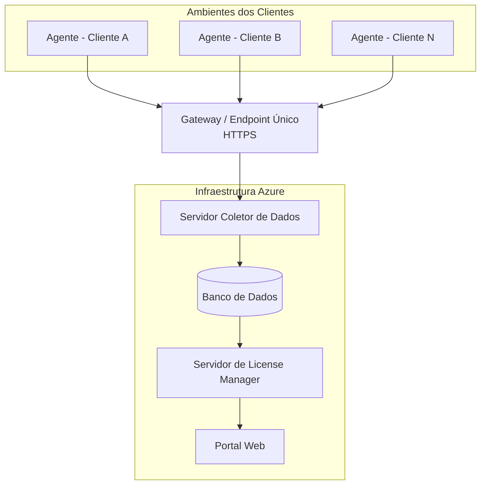

# Arquitetura Multi-Tenant no Azure para Plataforma SaaS de Gestão de Ativos

> Provisionamento de infraestrutura Azure para suportar uma ferramenta de gestão de licenciamento de software (SaaS) em modelo Service Provider, atendendo múltiplos clientes através de um endpoint compartilhado.

## Problema que resolve

Uma ferramenta de gestão de ativos e licenciamento de software precisava ser oferecida como serviço a múltiplos clientes corporativos, cada um com seus próprios agentes de coleta instalados em ambientes on-premises e híbridos. O desafio era desenhar uma infraestrutura na nuvem que:

- Centralizasse o recebimento de dados de múltiplos clientes sem exigir uma stack dedicada por cliente;
- Garantisse que a comunicação entre os agentes dos clientes e a infraestrutura central fosse segura e confiável;
- Fosse escalável o suficiente para onboarding de novos clientes sem redesenho de arquitetura.

## Arquitetura

## Decisões de arquitetura

**Endpoint único para múltiplos clientes (modelo Service Provider)**
Em vez de provisionar uma stack isolada por cliente, optou-se por um único gateway/endpoint HTTPS compartilhado, reduzindo custo operacional e tempo de onboarding de novos clientes. A inclusão de um novo cliente passa a exigir apenas configuração dos agentes, sem necessidade de nova infraestrutura.

**Separação entre coleta e processamento**
A camada de coleta de recebimento dos dados dos agentes foi mantida separada da camada de processamento/relatórios (License Manager), permitindo escalar cada componente de forma independente conforme o volume de clientes cresce.

**Comunicação segura por HTTPS**
Toda comunicação entre os agentes dos clientes e a infraestrutura central trafega por HTTPS, com liberação de rede tratada como etapa formal de onboarding de cada cliente (registro de IPs de origem, liberação de firewall).

## Desafios enfrentados

- **Coordenação de prazos entre times**: a criação da infraestrutura envolveu alinhamento entre múltiplas equipes (rede, segurança, aplicação e banco), o que exigiu comunicação constante para evitar retrabalho e mal-entendidos sobre o que já estava ou não disponível.
- **Comunicação clara de status**: em projetos com múltiplos stakeholders, uma parte relevante do trabalho foi garantir que o status técnico real (o que estava pronto vs. em progresso) fosse comunicado de forma consistente, evitando expectativas desalinhadas.
- **Desenho pensando em reuso**: a decisão de usar um endpoint único precisou equilibrar simplicidade operacional com a necessidade futura de isolar clientes caso o volume ou requisitos de segurança exigissem segregação maior.

## Resultados

- Infraestrutura provisionada no Azure capaz de atender ao primeiro cliente e replicável para clientes futuros sem redesenho.
- Processo de onboarding de novo cliente reduzido a configuração de agente + liberação de rede, sem necessidade de nova stack.
- Documentação técnica formalizada para transferência de conhecimento e auditoria do ambiente.

## Aprendizados

- Modelos multi-tenant simplificam operação, mas exigem decisão consciente sobre o trade-off entre economia de escala e isolamento entre clientes.
- Onboarding bem documentado (agentes, liberação de rede, endpoints) é o que realmente determina a velocidade de entrada de novos clientes num modelo de plataforma compartilhada.

---
**Autor:** Danilo Lima — Cloud Architect | Senior Cloud Specialist
[LinkedIn](https://linkedin.com/in/danilo-lima-9ba0375a/)

> Nota: este case study descreve um padrão de arquitetura real aplicado profissionalmente, com nomes de cliente, IPs e detalhes contratuais removidos por confidencialidade.
