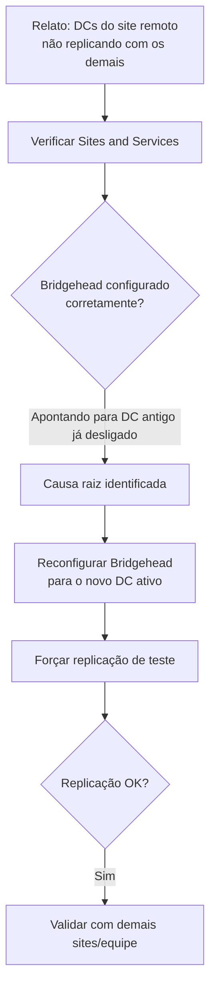

# Troubleshooting de Falha de Replicação entre Sites do Active Directory Após Descomissionamento de DCs

> Diagnóstico e correção de uma falha de replicação inter-site do Active Directory causada pela ausência de um servidor Bridgehead preferencial válido, após o desligamento de Domain Controllers antigos em um site remoto.

## Problema que resolve

Após o descomissionamento de Domain Controllers antigos em um site remoto (mantidos em um data center de colocation), novos Domain Controllers provisionados no mesmo site pararam de replicar corretamente com os demais sites do Active Directory. O ambiente continuava funcional localmente, mas a replicação entre esse site e os demais havia parado silenciosamente — um tipo de falha que não é imediatamente visível até gerar inconsistência de diretório entre localidades.

## O que é um Bridgehead Server

Em ambientes Active Directory com múltiplos sites (localidades), a replicação entre sites diferentes não acontece de qualquer DC para qualquer DC — ela passa por um servidor designado como **Bridgehead**, responsável por centralizar a replicação de/para aquele site com os demais. Se nenhum DC do site estiver designado (ou configurado) corretamente como bridgehead, a replicação inter-site para de funcionar, mesmo que a replicação intra-site (entre DCs do mesmo site) continue normal.

## Diagnóstico

## Causa raiz

Antes do descomissionamento, a configuração de Bridgehead preferencial daquele site apontava para um dos Domain Controllers antigos. Quando esses servidores foram desligados como parte da migração para os novos DCs, a referência de bridgehead não foi automaticamente transferida — resultando em um site sem nenhum servidor designado para replicação inter-site, mesmo com Domain Controllers novos e saudáveis presentes.

## Correção aplicada

A configuração de Bridgehead preferencial foi ajustada no Active Directory Sites and Services, apontando para um dos novos Domain Controllers do site. Após o ajuste, um teste de replicação foi executado para confirmar que o site voltou a trocar atualizações de diretório normalmente com os demais sites do ambiente.

## Desafios enfrentados

- **Sintoma silencioso**: a falha não gerava um erro óbvio no dia a dia — o ambiente local continuava funcional, o que atrasa a percepção do problema até haver divergência perceptível de diretório entre sites.
- **Efeito colateral de uma migração anterior**: a causa raiz não estava relacionada à configuração dos novos DCs em si, mas a uma configuração legada (bridgehead) que dependia dos servidores antigos e não foi migrada junto durante o processo de descomissionamento — reforçando a importância de mapear dependências de configuração, não só os objetos de servidor, antes de desligar uma infraestrutura antiga.
- **Coordenação entre membros da equipe**: o descomissionamento dos servidores antigos e o ajuste da nova configuração foram conduzidos por pessoas diferentes da equipe, exigindo alinhamento para garantir que o ajuste de bridgehead fosse atribuído e concluído.

## Resultados

- Replicação inter-site do Active Directory restaurada e validada, sem necessidade de intervenção nos Domain Controllers já em produção.
- Causa raiz documentada e comunicada à equipe, evitando que o mesmo problema se repetisse em futuras migrações de site.

## Aprendizados

- Ao descomissionar Domain Controllers, não basta migrar os papéis FSMO — configurações de nível de site (como Bridgehead preferencial) também podem depender do servidor antigo e precisam ser revisadas explicitamente.
- Falhas de replicação inter-site podem ser silenciosas por um tempo — vale incluir a validação de replicação entre sites como checklist padrão após qualquer descomissionamento de DC, não apenas como reação a um sintoma relatado.

---
**Autor:** Danilo Lima — Cloud Architect | Senior Cloud Specialist
[LinkedIn](https://linkedin.com/in/danilo-lima-9ba0375a/)

> Nota: este case study descreve um troubleshooting real de Active Directory conduzido profissionalmente, com nomes de servidores, colegas e ambiente removidos por confidencialidade.
