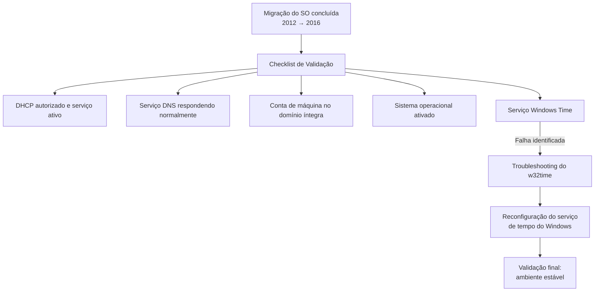

# Migração de Domain Controller: Upgrade de Windows Server 2012 para 2016

> Migração de versão de sistema operacional de um Domain Controller de produção (Windows Server 2012 para 2016), com checklist de validação pós-migração e troubleshooting de um serviço crítico que apresentou falha após o upgrade — atividade conduzida em equipe.

## Problema que resolve

Domain Controllers rodando versões de sistema operacional próximas do fim do ciclo de suporte precisam ser migrados para versões mais recentes, mantendo a continuidade dos serviços de diretório (autenticação, DNS, DHCP) durante e após o processo. Esse tipo de migração é sensível porque um DC concentra múltiplos serviços críticos de infraestrutura — qualquer falha silenciosa após o upgrade pode não ser percebida imediatamente, mas comprometer autenticação ou resolução de nomes na rede.

O trabalho foi conduzido em equipe, com responsabilidade compartilhada pela execução da migração e validação pós-upgrade de um Domain Controller de produção.

## Checklist de validação pós-migração



## O que foi validado

Após a migração do sistema operacional, um checklist foi seguido para confirmar que os serviços essenciais do Domain Controller continuavam saudáveis: autorização e funcionamento do DHCP, resposta normal do serviço de DNS, integridade da conta de máquina no domínio e confirmação de ativação do sistema operacional.

## Troubleshooting: falha no serviço Windows Time

Durante a validação, o servidor apresentou falha ao iniciar o serviço **Windows Time (w32time)** — serviço responsável por manter a sincronização de horário do Domain Controller, crítico porque o Kerberos (protocolo de autenticação do Active Directory) depende de relógios sincronizados entre servidores e estações para funcionar corretamente.

A correção envolveu parar e reconfigurar o serviço do zero:

```
net stop w32time
w32tm /unregister
w32tm /register
sc config w32time type= own
net start w32time
w32tm /config /update /manualpeerlist:"time.windows.com",0x8 /syncfromflags:MANUAL /reliable:yes
w32tm /resync /update
```

Esse procedimento remove o registro do serviço, registra novamente do zero, ajusta o tipo de inicialização do serviço e reconfigura a fonte de sincronização de horário manualmente — resolvendo casos em que o serviço fica com registro corrompido após um upgrade de sistema operacional.

## Desafios enfrentados

- **Falha não prevista pelo checklist padrão de migração**: o problema no serviço de horário não era um item esperado do roteiro de migração, exigindo diagnóstico adicional durante a própria janela de validação.
- **Criticidade do serviço afetado**: como o Windows Time impacta diretamente a autenticação Kerberos, a correção precisou ser tratada com prioridade antes de considerar a migração concluída, mesmo os demais serviços (DNS, DHCP, conta de domínio) já estando saudáveis.
- **Trabalho em equipe com responsabilidades compartilhadas**: a execução e validação da migração envolveu mais de uma pessoa da equipe, exigindo alinhamento sobre o que já havia sido verificado e o que ainda precisava de checagem.

## Resultados

- Domain Controller migrado com sucesso para Windows Server 2016, com todos os serviços essenciais validados como saudáveis.
- Falha no serviço de horário identificada e corrigida antes de declarar a migração concluída, evitando problemas futuros de autenticação Kerberos.
- Procedimento de correção do Windows Time documentado para reaproveitamento em migrações futuras semelhantes.

## Aprendizados

- Migrações de sistema operacional em Domain Controllers exigem validação que vai além do "o servidor ligou" — serviços dependentes como sincronização de horário precisam de checagem explícita, já que uma falha ali pode não ser percebida imediatamente mas afeta autenticação.
- Ter um checklist padrão pós-migração (DHCP, DNS, conta de domínio, ativação, serviço de horário) ajuda a capturar problemas antes que se tornem incidentes reportados por usuários.

---
**Autor:** Danilo Lima — Cloud Architect | Senior Cloud Specialist
[LinkedIn](https://linkedin.com/in/danilo-lima-9ba0375a/)

> Nota: este case study descreve uma atividade real de migração de infraestrutura conduzida em equipe profissionalmente, com nomes de servidores, colegas e ambiente removidos por confidencialidade.
