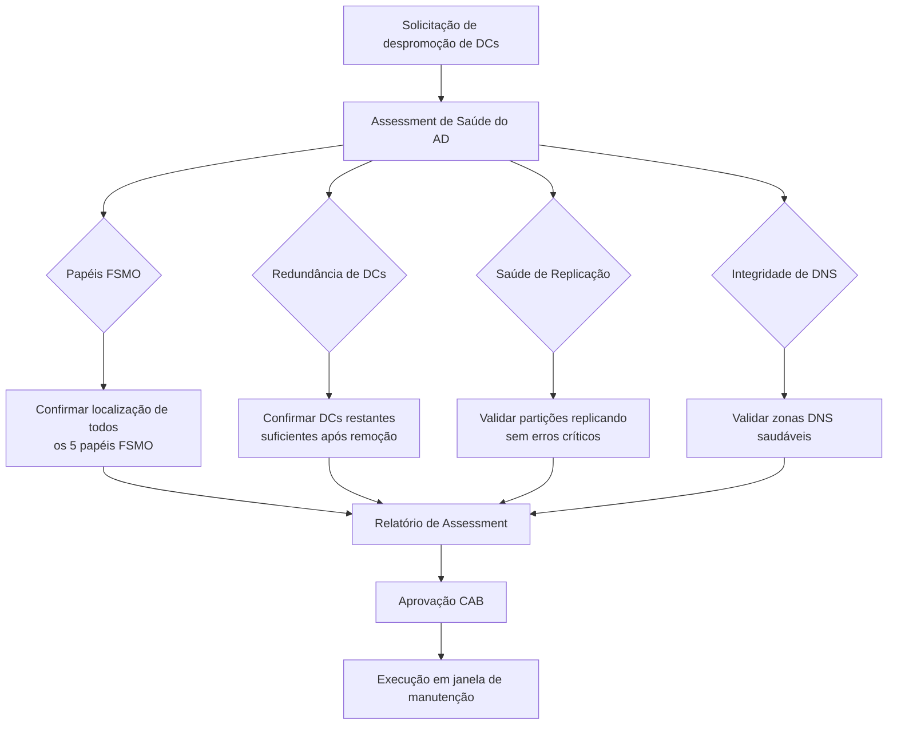

# Assessment de Saúde e Despromoção Segura de Domain Controllers (Active Directory)

> Diagnóstico completo de saúde do Active Directory antes da despromoção de Domain Controllers redundantes, cobrindo papéis FSMO, replicação, integridade de DNS e gestão de credenciais elevadas, conduzido sob processo formal de aprovação de mudança (CAB).

## Problema que resolve

A descontinuação de Domain Controllers (DCs) redundantes num ambiente Active Directory é uma operação de risco — remover o DC errado, ou remover um DC sem antes confirmar a saúde da replicação e a localização dos papéis FSMO, pode causar inconsistência de diretório, falhas de autenticação e problemas de resolução de nomes (DNS) em toda a organização.

O objetivo foi realizar um assessment técnico completo antes de qualquer ação de despromoção, documentando o estado real do ambiente para embasar a decisão e obter aprovação formal antes da execução.

## Abordagem do assessment

## O que foi verificado

**Papéis FSMO (Flexible Single Master Operations)**
Confirmação de qual Domain Controller concentrava os cinco papéis FSMO (Schema Master, Domain Naming Master, PDC Emulator, RID Master e Infrastructure Master) — informação crítica antes de qualquer despromoção, já que remover o DC errado sem transferir esses papéis primeiro pode interromper operações essenciais do domínio.

**Redundância de Domain Controllers**
Levantamento da quantidade de DCs ativos no ambiente antes da despromoção, garantindo que a quantidade remanescente continuasse suficiente para alta disponibilidade de autenticação e resolução de nomes.

**Saúde de replicação do Active Directory**
Teste de replicação entre os DCs para confirmar que todas as partições do diretório estavam replicando corretamente e sem erros, evitando que uma despromoção acontecesse sobre uma base de dados de diretório já inconsistente.

**Integridade do DNS**
Validação de que as zonas DNS associadas ao domínio respondiam corretamente e estavam saudáveis, já que Domain Controllers frequentemente hospedam também o serviço de DNS integrado ao Active Directory.

**Gestão de credenciais elevadas**
A atividade exigia permissão de Domain Admin, superior ao acesso padrão de operação — a credencial elevada foi solicitada e concedida de forma temporária pelo cliente especificamente para a execução da atividade, seguindo princípio de acesso mínimo necessário.

## Desafios enfrentados

- **Diagnóstico limitado por permissão insuficiente**: parte dos testes iniciais retornou erros (ex: falhas de consulta RPC) não por problema real no Active Directory, mas por limitação de permissão da conta usada até aquele momento — exigindo identificar corretamente a causa raiz do erro antes de concluir (falha real vs. falha de permissão) e solicitar elevação de acesso apropriada.
- **Coordenação de janela de manutenção**: a atividade precisou ser agendada considerando o impacto potencial em autenticação de usuários, exigindo alinhamento sobre o horário mais seguro para execução.
- **Processo formal de aprovação (CAB)**: a mudança passou por um comitê de aprovação formal antes da execução, exigindo que o assessment fosse documentado de forma clara o suficiente para embasar a decisão de aprovação por pessoas que não acompanharam o diagnóstico técnico em detalhe.

## Resultados

- Assessment completo documentado, confirmando ambiente saudável (FSMO, replicação e DNS) antes de qualquer ação de despromoção.
- Identificação de que erros aparentes eram causados por permissão insuficiente, evitando um diagnóstico equivocado de falha real no Active Directory.
- Mudança aprovada formalmente via CAB e executada em janela de manutenção acordada, com credencial elevada concedida apenas pelo tempo necessário.

## Aprendizados

- Nem todo erro reportado por uma ferramenta de diagnóstico indica falha real — distinguir entre "erro de permissão" e "erro de infraestrutura" evita decisões equivocadas sobre a saúde real do ambiente.
- Operações de risco em Active Directory (como despromoção de DCs) se beneficiam de um assessment estruturado e documentado como pré-requisito, não apenas da experiência do executor — isso também facilita a aprovação formal por quem não domina os detalhes técnicos.

---
**Autor:** Danilo Lima — Cloud Architect | Senior Cloud Specialist
[LinkedIn](https://linkedin.com/in/danilo-lima-9ba0375a/)

> Nota: este case study descreve uma atividade real de manutenção de Active Directory conduzida profissionalmente, com nome de cliente, domínio, hostnames e dados de terceiros removidos por confidencialidade.
