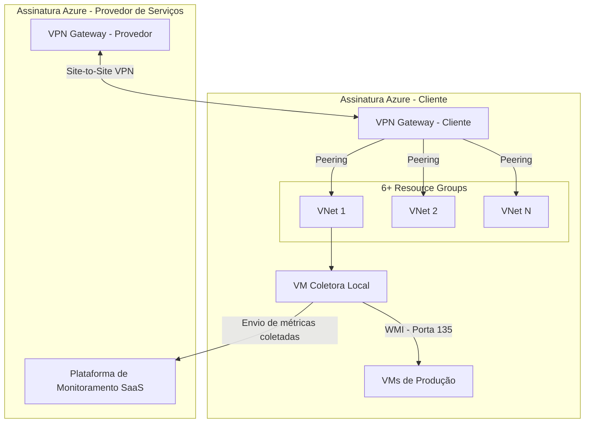

# Integração de Monitoramento SaaS Multi-Região no Azure via Peering e VPN Gateway

> Conectividade entre um coletor de monitoramento local e uma plataforma de monitoramento SaaS, através de VNet Peering entre assinaturas Azure distintas e VPN Gateway, com coleta de dados via WMI e ajustes de segurança em múltiplas camadas (NSG e firewall local).

## Problema que resolve

Uma plataforma de monitoramento entregue como SaaS (hospedada na assinatura Azure do provedor de serviços) precisava coletar métricas de disponibilidade e performance de dezenas de VMs de produção no ambiente de um cliente hispanohablante na América Latina, localizado em outro país e em uma assinatura Azure separada, com todo o alinhamento técnico do projeto conduzido em espanhol.

A coleta dependia de uma VM coletora local, dentro do ambiente do cliente, que reunia os dados via **WMI (porta 135)** e os enviava para a plataforma SaaS na nuvem. O ambiente do cliente era composto por **mais de 6 Resource Groups**, o que exigia conectividade consistente entre múltiplas VNets de duas assinaturas Azure diferentes (provedor de serviços e cliente).

## Arquitetura

## Decisões de arquitetura

**Coletor local + plataforma SaaS, em vez de agente por VM**
Em vez de instalar um agente de monitoramento em cada VM individualmente, optou-se por uma VM coletora central dentro do ambiente do cliente, que consulta as demais VMs via WMI e consolida os dados antes de enviá-los à plataforma SaaS — reduzindo o número de pontos precisando de configuração e manutenção.

**VPN Gateway em ambas as pontas + VNet Peering**
Como o ambiente do cliente e a plataforma SaaS estavam em assinaturas Azure diferentes, foi necessário criar um VPN Gateway tanto do lado do provedor de serviços quanto do lado do cliente, estabelecendo um túnel Site-to-Site entre as duas assinaturas. A partir daí, VNet Peering foi usado para estender essa conectividade aos mais de 6 Resource Groups do ambiente do cliente, evitando a criação de um túnel dedicado por VNet.

**WMI como protocolo de coleta**
A coleta de métricas das VMs de produção foi feita via WMI (porta 135), o que exigiu liberação específica dessa porta tanto na camada de rede (NSG) quanto no firewall do sistema operacional de cada VM — a liberação isolada em uma das duas camadas não seria suficiente.

## Desafios enfrentados

- **Múltiplos Resource Groups em uma única assinatura**: com mais de 6 Resource Groups no ambiente do cliente, foi necessário planejar o peering de forma a garantir que todos alcançassem o VPN Gateway sem introduzir rotas conflitantes.
- **Coordenação entre duas assinaturas Azure**: a criação do VPN Gateway precisou ser feita em ambas as pontas (provedor de serviços e cliente), exigindo alinhamento técnico cuidadoso sobre faixas de IP, configuração de túnel e validação de conectividade nos dois lados.
- **Liberação em múltiplas camadas para WMI**: a porta 135 precisou ser liberada tanto no NSG (camada de rede do Azure) quanto no firewall local de cada VM (sistema operacional) — um esquecimento em qualquer uma das camadas resultava em falha silenciosa de coleta.
- **Ausência de AD centralizado**: como o ambiente do cliente não possuía um Active Directory centralizado, parte das VMs não tinha a configuração de WMI padronizada via GPO — foi necessário desenvolver um script para aplicar a configuração de WMI manualmente nessas máquinas.
- **Roteamento conflitante em VMs específicas**: duas máquinas já estavam associadas a outro VPN Gateway pré-existente no ambiente, o que exigiu a criação de uma tabela de rotas dedicada apenas para esses dois casos, direcionando corretamente o tráfego de monitoramento sem interferir na rota já em uso por essas VMs.
- **Comunicação técnica em espanhol**: o alinhamento técnico e a validação de cada etapa foram conduzidos diretamente com o time do cliente em espanhol, exigindo comunicação técnica precisa em um segundo idioma para evitar ambiguidade nas liberações de rede solicitadas.

## Resultados

- Monitoramento centralizado ativo, coletando métricas de VMs de produção distribuídas em mais de 6 Resource Groups, através de dois ambientes Azure distintos.
- Conectividade estabelecida de forma auditável (VPN Gateway + Peering nomeados), sem expor endpoints diretamente à internet.
- Processo de liberação de porta documentado em duas camadas (rede e host), reduzindo retrabalho em futuras expansões do ambiente monitorado.

## Aprendizados

- Em arquiteturas SaaS multi-tenant que cruzam assinaturas Azure diferentes, o desenho de conectividade (VPN Gateway + Peering) é tão crítico quanto a própria ferramenta sendo integrada.
- Protocolos legados como WMI exigem atenção redobrada a liberações em múltiplas camadas de segurança — network e host — que nem sempre estão documentadas juntas.

---
**Autor:** Danilo Lima — Cloud Architect | Senior Cloud Specialist
[LinkedIn](https://linkedin.com/in/danilo-lima-9ba0375a/)

> Nota: este case study descreve um padrão de arquitetura de rede real aplicado profissionalmente, com nomes de cliente, IPs, VNets e identificadores de recursos removidos por confidencialidade.
