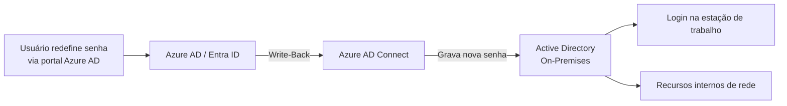

# Implementação de SSPR Write-Back com Ajustes em Active Directory e Azure AD Connect

> Habilitação do Self-Service Password Reset (SSPR) com Write-Back para um ambiente híbrido, permitindo que redefinições de senha feitas pelo usuário no Azure AD fossem sincronizadas de volta ao Active Directory on-premises, com ajustes de permissão no AD e configuração no Azure AD Connect.

## Problema que resolve

Em ambientes híbridos (identidade sincronizada entre Active Directory on-premises e Azure AD/Entra ID), habilitar apenas o SSPR no Azure AD permite que o usuário redefina a própria senha na nuvem — mas, sem o recurso de **Write-Back**, essa nova senha não é refletida no Active Directory local. Isso gera uma experiência inconsistente: o usuário redefine a senha, mas ela não funciona para recursos que ainda autenticam contra o AD on-premises (ex: login na estação de trabalho, compartilhamentos de rede internos).

O objetivo foi habilitar o SSPR com Write-Back, sincronizando a nova senha de volta ao AD local automaticamente, e resolver os ajustes de permissão necessários para que essa sincronização funcionasse corretamente.

## Como o SSPR Write-Back funciona

## Ajustes necessários

**Permissões no Active Directory**
O Azure AD Connect precisa de permissão delegada sobre os objetos de usuário no Active Directory para poder gravar a nova senha de volta — sem essa delegação configurada corretamente na(s) Unidade(s) Organizacional(is) relevante(s), a sincronização de write-back falha silenciosamente ou é rejeitada.

**Configuração no Azure AD Connect**
O recurso de Password Writeback precisa estar habilitado explicitamente na ferramenta de sincronização (Azure AD Connect), além da confirmação de que a conta de serviço utilizada pela sincronização possui as permissões concedidas no passo anterior.

## Desafios enfrentados

- **Permissão delegada incompleta**: a delegação de permissão no Active Directory precisou ser revisada e corrigida, pois a permissão inicial não cobria corretamente os objetos de usuário necessários para o write-back funcionar em todos os casos.
- **Validação ponta a ponta**: testar o fluxo completo — desde a redefinição pelo usuário no portal até a confirmação de que a nova senha realmente funcionava no logon local — para garantir que a configuração estava correta e não apenas "aparentemente" funcionando no lado do Azure AD.
- **Ambiente híbrido em produção**: qualquer ajuste de permissão delegada no Active Directory precisou ser aplicado com cuidado, por afetar diretamente objetos de usuário de um ambiente já em produção.

## Resultados

- SSPR com Write-Back funcionando de ponta a ponta: redefinições de senha feitas pelo usuário no Azure AD passaram a refletir corretamente no Active Directory on-premises.
- Experiência de autenticação consistente entre nuvem e ambiente local, eliminando o cenário de senha "diferente" entre os dois ambientes.
- Ajuste de permissão delegada documentado, servindo de referência para habilitação do mesmo recurso em outros ambientes híbridos.

## Aprendizados

- Habilitar um recurso na nuvem (como SSPR) que depende de sincronização com o ambiente on-premises exige verificar as duas pontas — a configuração do lado cloud pode parecer completa enquanto a permissão do lado on-premises ainda está incompleta.
- Validação ponta a ponta (não apenas "a opção está marcada como habilitada") é essencial em qualquer recurso híbrido que dependa de sincronização entre dois sistemas de identidade.

---
**Autor:** Danilo Lima — Cloud Architect | Senior Cloud Specialist
[LinkedIn](https://linkedin.com/in/danilo-lima-9ba0375a/)

> Nota: este case study descreve uma implementação real de identidade híbrida conduzida profissionalmente, com nome de cliente e dados de ambiente removidos por confidencialidade.
