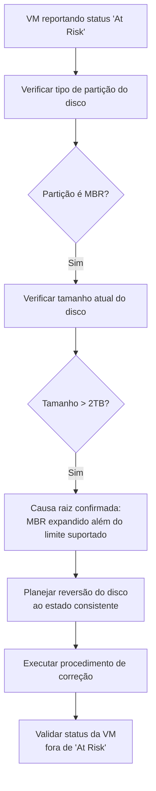

# Correção de Disco VMware "At Risk" Após Expansão Incorreta Além do Limite de 2TB (MBR)

> Diagnóstico e correção de um disco virtual formatado em MBR que foi expandido além do limite de 2TB suportado por esse tipo de partição, causando o status "At Risk" no VMware, com reversão do disco ao estado consistente sem perda de dados.

## Problema que resolve

Discos virtuais formatados com partição **MBR (Master Boot Record)** têm um limite de endereçamento de **2TB**. Quando um disco MBR é expandido além desse limite — seja por engano ou por falta de atenção ao tipo de partição antes da expansão — a VM continua rodando, mas o VMware passa a reportar o disco/VM com o status **"At Risk"**, sinalizando um estado potencialmente inconsistente que pode comprometer operações futuras (como consolidação de snapshot) se não for corrigido.

O desafio era corrigir esse estado sem interromper o serviço rodando na VM e sem perda de dados armazenados no disco.

## Diagnóstico

## Causa raiz

O disco havia sido expandido para um tamanho superior a 2TB sem observar que a partição em uso ainda era MBR — formato que não suporta endereçamento acima desse limite (diferente do GPT, que suporta discos maiores). Isso deixou o disco em um estado que o VMware identificou como inconsistente, refletido no alerta de risco na VM.

## Correção aplicada

O procedimento de correção envolveu reverter o disco ao seu estado anterior consistente (dentro do limite suportado pela partição MBR), evitando manter o disco numa configuração não suportada pela plataforma. Esse tipo de correção normalmente é feito através de comandos de manipulação de disco no nível do datastore (ex: `vmkfstools`) para redimensionar o VMDK de volta a um tamanho compatível, preservando os dados existentes.

## Desafios enfrentados

- **Correção sem downtime**: o disco precisava ser corrigido com o menor impacto possível na disponibilidade do serviço rodando na VM.
- **Risco de perda de dados**: qualquer operação de redimensionamento de disco carrega risco inerente — o procedimento precisou ser validado cuidadosamente antes da execução, incluindo garantir backup/snapshot prévio como rede de segurança.
- **Identificação da causa raiz não óbvia**: o sintoma reportado pela plataforma ("At Risk") não indica diretamente que a causa é uma limitação de tipo de partição — foi necessário investigar o histórico de expansão do disco para conectar o sintoma à causa real.

## Resultados

- Disco revertido a um estado consistente, removendo o status "At Risk" da VM sem perda de dados.
- Causa raiz documentada (limite de 2TB em discos MBR), servindo como referência para evitar o mesmo erro em expansões futuras.

## Aprendizados

- Antes de expandir qualquer disco virtual, é essencial confirmar o tipo de partição (MBR vs. GPT) — a decisão de qual formato usar deveria ser tomada no provisionamento inicial do disco, prevendo se ele algum dia pode precisar ultrapassar 2TB.
- Alertas genéricos de plataforma como "At Risk" exigem investigação de causa raiz indo além do sintoma reportado — a mensagem por si só não indica que o problema é uma limitação de partição.

---
**Autor:** Danilo Lima — Cloud Architect | Senior Cloud Specialist
[LinkedIn](https://linkedin.com/in/danilo-lima-9ba0375a/)

> Nota: este case study descreve um troubleshooting real de infraestrutura de virtualização conduzido profissionalmente, com dados de ambiente removidos por confidencialidade.
